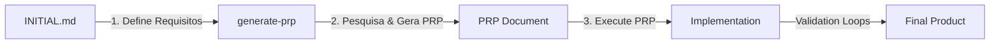

# Guia Abrangente do Framework PRP (Product Requirement Prompt)

## 📚 Sumário

1. [Introdução ao Framework PRP](#introdução-ao-framework-prp)
2. [Descoberta e Análise do Padrão](#descoberta-e-análise-do-padrão)
3. [Arquitetura do Framework](#arquitetura-do-framework)
4. [Fluxo de Trabalho PRP](#fluxo-de-trabalho-prp)
5. [Componentes Essenciais](#componentes-essenciais)
6. [Implementações Específicas de Domínio](#implementações-específicas-de-domínio)
7. [Padrões Comuns e Melhores Práticas](#padrões-comuns-e-melhores-práticas)
8. [Sistema de Comandos Claude](#sistema-de-comandos-claude)
9. [Validação e Garantia de Qualidade](#validação-e-garantia-de-qualidade)
10. [Casos de Uso e Exemplos](#casos-de-uso-e-exemplos)
11. [Integração com MCP](#integração-com-mcp)
12. [Conclusão e Próximos Passos](#conclusão-e-próximos-passos)

---

## 🎯 Introdução ao Framework PRP

O **PRP (Product Requirement Prompt)** é um meta-framework sofisticado para engenharia de contexto que foi descoberto através da análise de múltiplos casos de uso em `/Users/agents/Desktop/claude-20x/agents-a2a/.conductor/kinshasa/context-engineering-turso/`. 

### O que é PRP?

PRP é uma metodologia estruturada que transforma requisitos de alto nível em implementações completas através de um processo sistemático de:
- **Pesquisa extensiva** (principalmente via web)
- **Geração de contexto abrangente**
- **Execução validada por loops de teste**

### Por que PRP é revolucionário?

1. **Agnóstico de Domínio**: Funciona para qualquer tecnologia ou framework
2. **Orientado por Pesquisa**: Enfatiza pesquisa web extensiva antes da implementação
3. **Auto-validante**: Inclui loops de validação executáveis em cada etapa
4. **Context-First**: Prioriza contexto abrangente sobre código

---

## 🔍 Descoberta e Análise do Padrão

### Contexto da Descoberta

Durante a migração de ferramentas MCP entre Claude Code e Cursor Agent, descobrimos uma estrutura consistente em múltiplos diretórios:

```
/use-cases/
├── mcp-server/.claude/commands/
├── template-generator/.claude/commands/
└── pydantic-ai/.claude/commands/
```

### Padrão Identificado

Cada caso de uso segue rigorosamente um padrão de três etapas:

1. **INITIAL.md** - Arquivo de requisitos iniciais
2. **generate-{domain}-prp.md** - Comando para gerar PRP específico do domínio
3. **execute-{domain}-prp.md** - Comando para executar o PRP gerado

### Evidências do Padrão

#### MCP Server
- `prp-mcp-create.md` - Cria PRPs para servidores MCP
- `execute-mcp-prp.md` - Executa PRPs de MCP

#### Template Generator
- `generate-template-prp.md` - Gera PRPs para templates de qualquer tecnologia
- `execute-template-prp.md` - Executa PRPs de template

#### PydanticAI
- `generate-pydantic-ai-prp.md` - Gera PRPs para agentes de IA
- `execute-pydantic-ai-prp.md` - Executa PRPs de PydanticAI

---

## 🏗️ Arquitetura do Framework

### Estrutura de Diretórios Padrão

```
use-cases/{domain}/
├── CLAUDE.md                          # Regras globais do domínio
├── .claude/commands/                  # Comandos slash específicos
│   ├── generate-{domain}-prp.md       # Gerador de PRP
│   └── execute-{domain}-prp.md        # Executor de PRP
├── PRPs/                              # Diretório de PRPs
│   ├── templates/                     # Templates base
│   │   └── prp_{domain}_base.md      # Template PRP do domínio
│   ├── ai_docs/                       # Documentação auxiliar
│   └── INITIAL.md                     # Requisitos iniciais
├── examples/                          # Exemplos do domínio
├── copy_template.py                   # Script de deployment
└── README.md                          # Documentação
```

### Componentes Arquiteturais

#### 1. **CLAUDE.md** - Regras Globais do Domínio
Define princípios imutáveis que se aplicam a todo trabalho no domínio:
- Convenções de nomenclatura
- Padrões arquiteturais
- Fluxos de trabalho
- Melhores práticas

#### 2. **Comandos Slash** (.claude/commands/)
Automações específicas do domínio acessíveis via `/comando`:
- Geração de PRPs
- Execução de PRPs
- Validação
- Utilitários do domínio

#### 3. **Sistema de PRPs**
- **Templates Base**: Estruturas reutilizáveis
- **PRPs Gerados**: Implementações específicas
- **Documentação AI**: Contexto adicional

#### 4. **Sistema de Validação**
Loops executáveis que garantem qualidade:
- Testes de sintaxe
- Validação de estrutura
- Testes funcionais
- Verificação de completude

---

## 🔄 Fluxo de Trabalho PRP

### O Processo de 3 Etapas



### Etapa 1: Definição de Requisitos (INITIAL.md)

```markdown
# Funcionalidade: [Nome da Funcionalidade]

## Objetivo
[Descrição clara do que precisa ser construído]

## Requisitos Específicos
- [Requisito 1]
- [Requisito 2]
- [Requisito 3]

## Exemplos Desejados
[Exemplos de uso ou comportamento esperado]

## Considerações Técnicas
[Limitações, integrações, performance]
```

### Etapa 2: Geração de PRP

```bash
/generate-{domain}-prp INITIAL.md
```

Este comando:
1. **Lê os requisitos** do INITIAL.md
2. **Faz pesquisa web extensiva** sobre a tecnologia
3. **Analisa padrões existentes** no codebase
4. **Gera PRP abrangente** com todo contexto necessário

### Etapa 3: Execução do PRP

```bash
/execute-{domain}-prp PRPs/feature-name.md
```

Este comando:
1. **Carrega o PRP** com todo contexto
2. **Implementa seguindo o plano** documentado
3. **Executa loops de validação** em cada etapa
4. **Produz implementação completa** e testada

---

## 🧩 Componentes Essenciais

### 1. Sistema de Pesquisa

**Princípio Central**: "Pesquisa web é sua melhor amiga"

Cada gerador de PRP enfatiza:
```markdown
## Processo de Pesquisa

1. **Análise do Codebase**
   - Pesquisar por funcionalidades similares
   - Identificar padrões existentes
   - Notar convenções para seguir

2. **Pesquisa Externa**
   - Documentação oficial (URLs específicas)
   - Exemplos de implementação
   - Melhores práticas
   - Armadilhas comuns
```

### 2. Estrutura do PRP

Todo PRP segue esta estrutura:

```markdown
# PRP: [Nome da Funcionalidade]

## Contexto da Pesquisa
[Descobertas da pesquisa web documentadas]

## Arquitetura Proposta
[Design detalhado baseado na pesquisa]

## Plano de Implementação
[Etapas ordenadas com dependências]

## Portões de Validação
[Comandos executáveis para verificar cada etapa]

## Critérios de Sucesso
[Checklist mensurável de conclusão]
```

### 3. Loops de Validação

Exemplo de validação executável:
```bash
# Sintaxe/Estilo
ruff check --fix && mypy .

# Testes
pytest tests/ -v

# Estrutura
find . -name "*.py" | xargs wc -l

# Funcionalidade
python -m module.main --test
```

### 4. Sistema de Contexto

Elementos obrigatórios em PRPs:
- **URLs de documentação** com seções específicas
- **Exemplos de código** do codebase
- **Armadilhas conhecidas** e soluções
- **Padrões estabelecidos** para seguir

---

## 🌐 Implementações Específicas de Domínio

### 1. MCP Server Domain

**Foco**: Criação de servidores Model Context Protocol

**Características Únicas**:
- Integração com protocolos de comunicação
- Gerenciamento de ferramentas e recursos
- Compatibilidade multi-ambiente (Claude Code, Cursor Agent)

**Comando Específico**:
```bash
/prp-mcp-create requirements.md
```

**Validações Específicas**:
- Teste de protocolo MCP
- Verificação de compatibilidade de ferramentas
- Testes de integração com ambientes

### 2. Template Generator Domain

**Foco**: Meta-geração de templates para qualquer tecnologia

**Características Únicas**:
- Recursivo (gera geradores)
- Agnóstico de tecnologia
- Inclui script `copy_template.py`

**Comando Específico**:
```bash
/generate-template-prp technology-requirements.md
```

**Validações Específicas**:
- Verificação de estrutura de template
- Teste de funcionalidade do script de cópia
- Validação de completude do conteúdo

### 3. PydanticAI Domain

**Foco**: Desenvolvimento de agentes de IA com PydanticAI

**Características Únicas**:
- Gerenciamento de variáveis de ambiente com python-dotenv
- Arquitetura modular (agent.py, tools.py, models.py)
- Padrões TestModel/FunctionModel

**Comando Específico**:
```bash
/generate-pydantic-ai-prp agent-requirements.md
```

**Validações Específicas**:
- Teste com TestModel
- Verificação de injeção de dependências
- Validação de ferramentas do agente

---

## 📋 Padrões Comuns e Melhores Práticas

### 1. Princípios Universais

#### Context is King
- Sempre forneça contexto abrangente
- Documente todas as descobertas de pesquisa
- Inclua exemplos funcionais

#### Research-First Development
- Pesquisa web extensiva antes de implementar
- Estude documentação oficial
- Analise implementações existentes

#### Validation-Driven
- Cada etapa tem validação executável
- Falha rápida, falha informativa
- Loops de correção automática

### 2. Estrutura de Comandos

#### Padrão de Nomenclatura
```
generate-{domain}-prp.md
execute-{domain}-prp.md
```

#### Padrão de Argumentos
```bash
$ARGUMENTS  # Sempre o caminho para arquivo de entrada
```

#### Padrão de Saída
```
PRPs/{feature-name}.md  # PRPs gerados
use-cases/{domain}/     # Templates gerados
```

### 3. Anti-Padrões a Evitar

❌ **Pular pesquisa** - Sempre pesquise extensivamente primeiro
❌ **Ignorar validação** - Cada etapa precisa verificação
❌ **Criar do zero** - Use padrões existentes como base
❌ **Assumir conhecimento** - Documente tudo explicitamente
❌ **Esquecer casos extremos** - Inclua tratamento de erro

### 4. Padrões de Qualidade

#### Checklist de Qualidade para PRPs
- [ ] Todo contexto necessário incluído
- [ ] Portões de validação executáveis
- [ ] Referencia padrões existentes
- [ ] Caminho de implementação claro
- [ ] Tratamento de erro documentado

#### Scoring System
```
Pontue o PRP em uma escala de 1-10
(nível de confiança para sucesso de implementação)
```

---

## 🤖 Sistema de Comandos Claude

### Descoberta dos Comandos

Os comandos foram descobertos em:
```
.claude/commands/
```

### Características dos Comandos

1. **Arquivos Markdown** - Cada comando é um arquivo .md
2. **Nome é o Comando** - `/generate-template-prp` executa `generate-template-prp.md`
3. **$ARGUMENTS** - Variável especial para argumentos
4. **Instruções Detalhadas** - Cada comando é auto-documentado

### Anatomia de um Comando

```markdown
# [Título do Comando]

## Arquivo de entrada: $ARGUMENTS

[Descrição do que o comando faz]

## Processo de Execução

1. **[Etapa 1]**
   - [Subetapas detalhadas]
   
2. **[Etapa 2]**
   - [Mais subetapas]

## Validação

```bash
[Comandos de validação]
```

## Saída

[Onde e como a saída é salva]
```

### Integração com Claude Code

1. Comandos aparecem no menu slash (`/`)
2. Executam com contexto completo do projeto
3. Podem chamar ferramentas (Read, Write, WebSearch, etc.)
4. Seguem o fluxo definido no arquivo .md

---

## ✅ Validação e Garantia de Qualidade

### Níveis de Validação

#### 1. Validação Estrutural
```bash
# Verificar estrutura de arquivos
find . -type f -name "*.md" | sort
ls -la .claude/commands/

# Verificar arquivos obrigatórios
test -f CLAUDE.md
test -f README.md
```

#### 2. Validação de Conteúdo
```bash
# Buscar placeholders
grep -r "TODO\|PLACEHOLDER" .

# Verificar completude
grep -r "WEBSEARCH_NEEDED" .
```

#### 3. Validação Funcional
```bash
# Testar comandos
/generate-prp test.md

# Verificar outputs
ls PRPs/
cat PRPs/latest.md
```

#### 4. Validação de Integração
```bash
# Testar fluxo completo
echo "# Test Feature" > INITIAL.md
/generate-prp INITIAL.md
/execute-prp PRPs/test-feature.md
```

### Loops de Correção

Se validação falhar:
1. **Analise o erro**
2. **Corrija componentes específicos**
3. **Re-valide até passar**
4. **Documente a correção**

---

## 📚 Casos de Uso e Exemplos

### Caso 1: Criando um Servidor MCP

```bash
# 1. Definir requisitos
cat > INITIAL.md << EOF
# MCP Server para GitHub API

## Objetivo
Criar servidor MCP que expõe ferramentas GitHub

## Ferramentas Necessárias
- list_repos
- create_issue
- get_pr_status
EOF

# 2. Gerar PRP
/prp-mcp-create INITIAL.md

# 3. Executar
/execute-mcp-prp PRPs/github-mcp-server.md
```

### Caso 2: Gerando Template para React

```bash
# 1. Definir requisitos
cat > INITIAL.md << EOF
# Template React com Context Engineering

## Objetivo
Template completo para projetos React com TypeScript

## Requisitos
- Estrutura de componentes
- Gerenciamento de estado
- Testes com Jest
- CI/CD pipeline
EOF

# 2. Gerar PRP
/generate-template-prp INITIAL.md

# 3. Executar
/execute-template-prp PRPs/template-react.md
```

### Caso 3: Desenvolvendo Agente PydanticAI

```bash
# 1. Definir requisitos
cat > INITIAL.md << EOF
# Agente de Análise de Código

## Objetivo
Agente que analisa qualidade de código Python

## Funcionalidades
- Detectar code smells
- Sugerir refatorações
- Gerar relatórios
EOF

# 2. Gerar PRP
/generate-pydantic-ai-prp INITIAL.md

# 3. Executar
/execute-pydantic-ai-prp PRPs/code-analyzer-agent.md
```

---

## 🔌 Integração com MCP

### Contexto da Descoberta

O framework PRP foi descoberto durante o desenvolvimento de um servidor MCP unificado que funciona tanto no Claude Code quanto no Cursor Agent.

### Sinergia PRP + MCP

1. **MCP fornece protocolo** - Comunicação padronizada
2. **PRP fornece metodologia** - Processo de desenvolvimento
3. **Juntos habilitam** - Desenvolvimento sistemático de ferramentas AI

### Exemplo: MCP Turso Unificado

```typescript
// Desenvolvido usando metodologia PRP
class UnifiedTursoServer {
  // 6 ferramentas essenciais
  - execute_read_only_query
  - execute_query
  - list_databases
  - get_database_info
  - list_tables
  - describe_table
}
```

### Fluxo de Desenvolvimento

1. **Requisitos** definidos em INITIAL.md
2. **PRP gerado** com pesquisa sobre protocolos MCP
3. **Implementação** seguindo plano do PRP
4. **Validação** em ambos ambientes
5. **Documentação** atualizada automaticamente

---

## 🚀 Conclusão e Próximos Passos

### O que Aprendemos

1. **PRP é um meta-framework** poderoso para engenharia de contexto
2. **Padrão consistente** através de múltiplos domínios
3. **Orientado por pesquisa** com validação embutida
4. **Extensível** para qualquer tecnologia

### Benefícios do Framework PRP

✅ **Consistência** - Mesmo processo para qualquer domínio
✅ **Qualidade** - Validação em cada etapa
✅ **Velocidade** - Reutilização de padrões
✅ **Confiabilidade** - Baseado em pesquisa extensiva
✅ **Manutenibilidade** - Estrutura clara e documentada

### Próximos Passos Recomendados

#### 1. Explorar Casos de Uso Existentes
```bash
cd use-cases/
ls -la
# Estudar cada implementação
```

#### 2. Criar Novo Domínio
```bash
# Usar template generator
cd use-cases/template-generator
python copy_template.py ../meu-novo-dominio
```

#### 3. Implementar Funcionalidade
```bash
cd use-cases/meu-novo-dominio
echo "# Minha funcionalidade" > PRPs/INITIAL.md
/generate-meu-dominio-prp PRPs/INITIAL.md
/execute-meu-dominio-prp PRPs/minha-funcionalidade.md
```

#### 4. Contribuir para o Framework
- Documentar novos padrões descobertos
- Criar templates para novas tecnologias
- Melhorar processos de validação
- Compartilhar casos de sucesso

### Reflexão Final

O framework PRP representa uma evolução significativa em como abordamos engenharia de software com IA. Ao priorizar contexto, pesquisa e validação, ele transforma o desenvolvimento de software em um processo mais previsível, confiável e eficiente.

A descoberta deste padrão durante nosso trabalho com MCP demonstra como padrões emergentes podem ser identificados e formalizados para benefício de toda a comunidade de desenvolvimento.

---

## 📖 Recursos Adicionais

### Documentação de Referência
- [MCP Documentation](https://modelcontextprotocol.io)
- [PydanticAI Docs](https://ai.pydantic.dev)
- [Claude Code Documentation](https://docs.anthropic.com/claude/docs)

### Exemplos no Codebase
- `/use-cases/mcp-server/` - Implementação MCP
- `/use-cases/template-generator/` - Meta-templates
- `/use-cases/pydantic-ai/` - Agentes AI

### Scripts Úteis
- `copy_template.py` - Deploy de templates
- `start-mcp-unified.sh` - Iniciar servidor MCP
- Comandos `.claude/commands/` - Automações

---

*Este documento consolida o conhecimento descoberto sobre o framework PRP durante a análise dos casos de uso de engenharia de contexto. Ele serve como guia definitivo para entender e aplicar esta metodologia poderosa.*