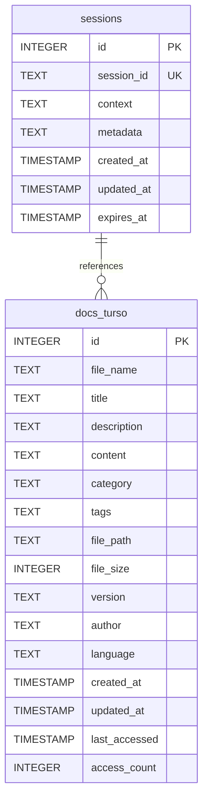

# Arquitetura Simplificada Turso + Claude Flow

## 🎯 Visão Geral

Este documento descreve a nova arquitetura simplificada do banco de dados Turso, focada em começar com o mínimo necessário e expandir conforme a demanda.

## 📊 Estrutura de Dados

### Tabelas Core (v1.0)



## 🚀 Casos de Uso

### 1. Armazenamento de Documentação
```typescript
// Exemplo: Salvar documentação de um agente
const saveAgentDocs = async (agent: AgentDefinition) => {
  await turso.execute({
    sql: `INSERT INTO docs_turso 
      (file_name, title, content, category, tags, author) 
      VALUES (?, ?, ?, ?, ?, ?)`,
    args: [
      `${agent.name}.md`,
      agent.title,
      agent.documentation,
      'agent',
      agent.capabilities.join(','),
      'Claude Flow System'
    ]
  });
};
```

### 2. Gerenciamento de Contexto
```typescript
// Exemplo: Manter contexto entre conversas
const createSession = async (sessionId: string, initialContext: any) => {
  await turso.execute({
    sql: `INSERT INTO sessions 
      (session_id, context, metadata, expires_at) 
      VALUES (?, ?, ?, datetime('now', '+24 hours'))`,
    args: [
      sessionId,
      JSON.stringify(initialContext),
      JSON.stringify({ 
        agent: 'claude-flow',
        version: '2.0.0'
      })
    ]
  });
};
```

### 3. Busca Inteligente
```typescript
// Exemplo: Buscar documentação relevante
const searchDocs = async (query: string, category?: string) => {
  const sql = category 
    ? `SELECT * FROM docs_turso 
       WHERE (title LIKE ? OR content LIKE ? OR tags LIKE ?) 
       AND category = ?
       ORDER BY access_count DESC`
    : `SELECT * FROM docs_turso 
       WHERE title LIKE ? OR content LIKE ? OR tags LIKE ?
       ORDER BY access_count DESC`;
  
  const pattern = `%${query}%`;
  const args = category 
    ? [pattern, pattern, pattern, category]
    : [pattern, pattern, pattern];
  
  return await turso.execute({ sql, args });
};
```

## 📈 Plano de Expansão

### Fase 1 - MVP (Atual) ✅
```
├── docs_turso (documentação)
└── sessions (contexto)
```

### Fase 2 - Interatividade (3-6 meses)
```
├── interactions (rastreamento de uso)
├── feedback (avaliações e comentários)
└── search_history (histórico de buscas)
```

### Fase 3 - Inteligência (6-12 meses)
```
├── embeddings (vetores para busca semântica)
├── analytics (métricas detalhadas)
└── recommendations (sugestões baseadas em uso)
```

### Fase 4 - Colaboração (12+ meses)
```
├── users (gestão de usuários)
├── teams (grupos e organizações)
├── permissions (controle de acesso granular)
├── audit_log (trilha de auditoria)
└── versions (versionamento completo)
```

## 🔧 Integração MCP

### Configuração Simplificada
```typescript
// mcp-turso/src/index.ts
export const tools = {
  // Operações básicas
  docs: {
    save: async (doc: Document) => { /* ... */ },
    get: async (id: string) => { /* ... */ },
    search: async (query: string) => { /* ... */ },
    update: async (id: string, updates: Partial<Document>) => { /* ... */ }
  },
  
  // Gerenciamento de sessão
  session: {
    create: async (id: string) => { /* ... */ },
    update: async (id: string, context: any) => { /* ... */ },
    get: async (id: string) => { /* ... */ },
    cleanup: async () => { /* ... */ }
  }
};
```

## 💡 Benefícios da Simplificação

1. **Desenvolvimento Mais Rápido**
   - Menos tabelas para gerenciar
   - Schema mais simples
   - Menos joins complexos

2. **Manutenção Facilitada**
   - Backup mais simples
   - Migrations mais diretas
   - Debug mais fácil

3. **Performance Otimizada**
   - Menos índices para manter
   - Queries mais diretas
   - Cache mais eficiente

4. **Escalabilidade Natural**
   - Adicionar tabelas conforme necessário
   - Sem over-engineering inicial
   - Crescimento baseado em uso real

## 🛠️ Comandos Úteis

```bash
# Simplificar banco existente
./mcp-turso/scripts/simplify.sh --backup

# Verificar estrutura atual
turso db shell claude-swarm-v2 ".tables"

# Contar documentos
turso db shell claude-swarm-v2 "SELECT COUNT(*) FROM docs_turso"

# Limpar sessões expiradas
turso db shell claude-swarm-v2 "DELETE FROM sessions WHERE expires_at < CURRENT_TIMESTAMP"
```

## 📋 Checklist de Migração

- [ ] Backup do banco atual
- [ ] Executar script de simplificação
- [ ] Atualizar integração MCP-Turso
- [ ] Ajustar aplicações dependentes
- [ ] Testar funcionalidades core
- [ ] Documentar mudanças
- [ ] Monitorar performance

## 🔮 Próximos Passos

1. **Implementar busca fuzzy** na tabela docs_turso
2. **Adicionar compressão** para campo content
3. **Criar API REST** simplificada
4. **Implementar webhooks** para eventos
5. **Adicionar cache Redis** opcional

Esta arquitetura simplificada permite começar rapidamente com o essencial e evoluir organicamente baseado nas necessidades reais do projeto.