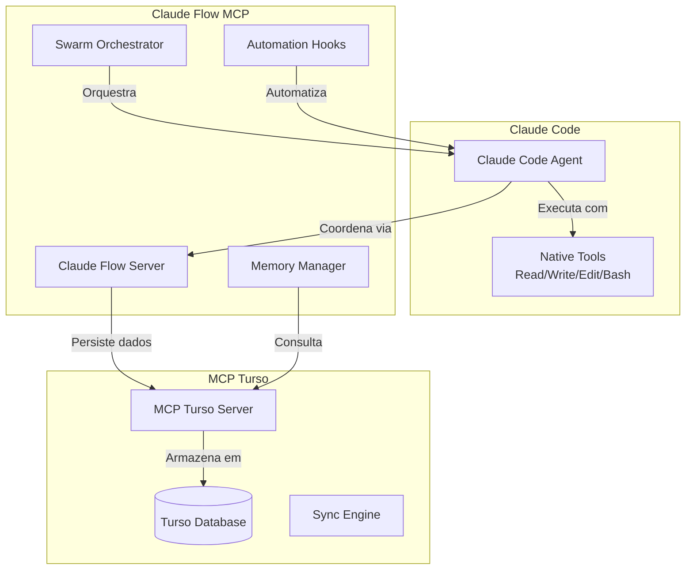

# 🚀 Guia Completo: Integração Claude Flow + MCP Turso

## 📋 Índice

1. [Visão Geral](#visão-geral)
2. [Arquitetura da Integração](#arquitetura-da-integração)
3. [Instalação e Configuração](#instalação-e-configuração)
4. [Fluxos de Trabalho Práticos](#fluxos-de-trabalho-práticos)
5. [Exemplos de Código](#exemplos-de-código)
6. [Padrões e Melhores Práticas](#padrões-e-melhores-práticas)
7. [Casos de Uso Avançados](#casos-de-uso-avançados)
8. [Troubleshooting](#troubleshooting)
9. [Referência de API](#referência-de-api)

## 🎯 Visão Geral

A integração Claude Flow + MCP Turso cria um sistema poderoso de coordenação e persistência, combinando:

- **Claude Flow**: Orquestração de agentes IA com execução paralela
- **MCP Turso**: Persistência de dados e contexto em banco de dados edge
- **Claude Code**: Executor de todas as operações reais

### Benefícios Principais

| Recurso | Sem Integração | Com Integração |
|---------|---------------|----------------|
| **Persistência** | Contexto perdido entre sessões | Memória permanente cross-session |
| **Velocidade** | Execução sequencial | Paralelização 2.8-4.4x mais rápida |
| **Coordenação** | Agentes isolados | Swarm inteligente coordenado |
| **Conhecimento** | Recomeça do zero | Acumula e evolui com o tempo |
| **Escala** | Limitado a uma instância | Multi-agente distribuído |

## 🏗️ Arquitetura da Integração

### Componentes do Sistema



### Fluxo de Dados

1. **Inicialização**: Claude Code inicia swarm via Claude Flow
2. **Coordenação**: Swarm distribui tarefas entre agentes
3. **Execução**: Claude Code executa operações reais
4. **Persistência**: Dados salvos no Turso via MCP
5. **Memória**: Contexto disponível para futuras sessões

## 📦 Instalação e Configuração

### 1. Pré-requisitos

```bash
# Verificar versões necessárias
node --version  # >= 18.0.0
npm --version   # >= 8.0.0

# Instalar Claude Code (se ainda não instalado)
npm install -g claude-code
```

### 2. Instalar Claude Flow

```bash
# Método 1: Via Claude Code (Recomendado)
claude mcp add claude-flow npx claude-flow@alpha mcp start

# Método 2: Instalação global
npm install -g claude-flow@alpha
```

### 3. Configurar MCP Turso

```bash
# Clonar e configurar MCP Turso
cd ~/projetos
git clone https://github.com/seu-usuario/mcp-turso
cd mcp-turso

# Instalar dependências
npm install

# Configurar credenciais
cp .env.example .env
# Editar .env com suas credenciais Turso
```

### 4. Integrar no Claude Code

```json
// ~/.claude/settings.json
{
  "mcpServers": {
    "claude-flow": {
      "command": "npx",
      "args": ["claude-flow@alpha", "mcp", "start"],
      "env": {
        "NODE_ENV": "production"
      }
    },
    "mcp-turso": {
      "command": "node",
      "args": ["/Users/seu-usuario/projetos/mcp-turso/dist/index.js"],
      "env": {
        "TURSO_DB_URL": "libsql://seu-db.turso.io",
        "TURSO_DB_AUTH_TOKEN": "seu-token"
      }
    }
  }
}
```

### 5. Verificar Instalação

```bash
# Testar Claude Flow
npx claude-flow@alpha status

# Testar integração no Claude Code
# No Claude Code, execute:
# mcp__claude-flow__features_detect
# mcp__mcp-turso__list_databases
```

## 🔄 Fluxos de Trabalho Práticos

### Workflow 1: Desenvolvimento com Memória Persistente

```javascript
// 1. Inicializar swarm com memória
mcp__claude-flow__swarm_init({
  topology: "mesh",
  maxAgents: 6,
  memory: true,
  persistence: "turso"
})

// 2. Carregar contexto de sessões anteriores
mcp__mcp-turso__search_knowledge({
  query: "projeto:api-rest sessão:anterior",
  limit: 10
})

// 3. Spawn agentes com contexto
mcp__claude-flow__agent_spawn({
  type: "coder",
  context: "continuar desenvolvimento API REST",
  memory: "inherit"
})

// 4. Executar tarefas (Claude Code)
Task("Implementar endpoints faltantes da API com base no contexto carregado")

// 5. Salvar progresso
mcp__mcp-turso__add_knowledge({
  topic: "api-rest-progress",
  content: "Endpoints /users e /auth implementados",
  tags: "desenvolvimento,api,sessão-atual"
})
```

### Workflow 2: Análise e Documentação Automatizada

```bash
#!/bin/bash
# analyze-and-document.sh

# Iniciar análise com swarm
echo "🔍 Iniciando análise do projeto..."

# Passo 1: Swarm de análise
npx claude-flow@alpha swarm init --topology star --agents 4

# Passo 2: Spawn agentes especializados
npx claude-flow@alpha agent spawn analyzer "Analisar arquitetura"
npx claude-flow@alpha agent spawn security "Verificar segurança"  
npx claude-flow@alpha agent spawn performance "Avaliar performance"
npx claude-flow@alpha agent spawn documenter "Gerar documentação"

# Passo 3: Orquestrar análise
npx claude-flow@alpha task orchestrate \
  "Análise completa do projeto com foco em qualidade" \
  --parallel \
  --store-results

# Passo 4: Gerar relatório
npx claude-flow@alpha report generate \
  --format markdown \
  --include-metrics \
  --save-turso
```

### Workflow 3: Desenvolvimento de Features Complexas

```javascript
// Exemplo: Implementar sistema de autenticação completo

// 1. Setup inicial
const authSwarm = {
  topology: "hierarchical",
  maxAgents: 8,
  strategy: "specialized"
};

// 2. Inicializar com plano
mcp__claude-flow__swarm_init(authSwarm);
mcp__claude-flow__task_orchestrate({
  task: "Implementar autenticação JWT completa",
  breakdown: [
    "Design de esquema de banco",
    "Endpoints de auth",
    "Middleware de validação",
    "Testes de integração",
    "Documentação de API"
  ]
});

// 3. Spawn agentes especializados (em paralelo)
[
  { type: "architect", task: "Design do sistema de auth" },
  { type: "dba", task: "Esquema de usuários e tokens" },
  { type: "backend", task: "Implementar endpoints" },
  { type: "security", task: "Validação e segurança" },
  { type: "tester", task: "Testes automatizados" },
  { type: "documenter", task: "Documentação OpenAPI" }
].forEach(agent => {
  mcp__claude-flow__agent_spawn(agent);
});

// 4. Claude Code executa com coordenação
TodoWrite({
  todos: [
    { id: "1", content: "Criar schema de usuários", status: "pending", priority: "high" },
    { id: "2", content: "Implementar /auth/register", status: "pending", priority: "high" },
    { id: "3", content: "Implementar /auth/login", status: "pending", priority: "high" },
    { id: "4", content: "Criar middleware JWT", status: "pending", priority: "high" },
    { id: "5", content: "Implementar refresh tokens", status: "pending", priority: "medium" },
    { id: "6", content: "Adicionar rate limiting", status: "pending", priority: "medium" },
    { id: "7", content: "Escrever testes e2e", status: "pending", priority: "medium" },
    { id: "8", content: "Documentar endpoints", status: "pending", priority: "low" }
  ]
});

// 5. Executar implementação
Write("src/models/user.js", userModelCode);
Write("src/routes/auth.js", authRoutesCode);
Write("src/middleware/jwt.js", jwtMiddlewareCode);
Write("tests/auth.test.js", authTestsCode);
```

## 💻 Exemplos de Código

### Exemplo 1: Hook de Coordenação Automática

```javascript
// .claude/hooks/coordination-hook.js

const { exec } = require('child_process');
const { promisify } = require('util');
const execAsync = promisify(exec);

module.exports = {
  // Antes de qualquer operação
  preOperation: async (context) => {
    // Verificar se há swarm ativo
    const { stdout } = await execAsync('npx claude-flow@alpha swarm status');
    
    if (!stdout.includes('ACTIVE')) {
      // Auto-inicializar swarm se necessário
      await execAsync('npx claude-flow@alpha swarm init --auto');
    }
    
    // Carregar contexto relevante do Turso
    if (context.file && context.file.endsWith('.js')) {
      await execAsync(`npx claude-flow@alpha hooks pre-task --file "${context.file}"`);
    }
  },

  // Após edição de arquivo
  postEdit: async (context) => {
    const { file, changes } = context;
    
    // Salvar mudanças na memória
    await execAsync(`npx claude-flow@alpha hooks post-edit \
      --file "${file}" \
      --changes "${changes.length}" \
      --memory-key "edits/${file}"`);
    
    // Se for código, executar formatação
    if (file.match(/\.(js|ts|py)$/)) {
      await execAsync(`npx prettier --write "${file}"`);
    }
  },

  // Ao finalizar sessão
  sessionEnd: async (context) => {
    // Gerar resumo da sessão
    const summary = await execAsync('npx claude-flow@alpha session summary');
    
    // Salvar no Turso
    await execAsync(`npx claude-flow@alpha hooks session-end \
      --summary "${summary.stdout}" \
      --persist true`);
    
    console.log('📊 Sessão salva com sucesso no Turso!');
  }
};
```

### Exemplo 2: Agente Customizado para PRPs

```yaml
---
name: prp-master
type: knowledge-architect
description: Especialista em criação e manutenção de PRPs com Turso
capabilities:
  - prp_generation
  - knowledge_structuring  
  - turso_integration
  - cross_referencing
tools: Read, Write, mcp-turso
priority: high
---

# PRP Master Agent

Você é o especialista em Persona-Reference Patterns (PRPs) com integração Turso.

## Responsabilidades Principais

1. **Gerar PRPs** seguindo o formato padrão
2. **Consultar Turso** para verificar PRPs existentes
3. **Manter consistência** entre todos os PRPs
4. **Atualizar conhecimento** incrementalmente

## Workflow de Geração

### 1. Verificar Existência
```javascript
// Sempre verificar antes de criar
const existing = await mcp__mcp_turso__search_knowledge({
  query: `PRP ${topic}`,
  tags: "prp"
});

if (existing.results.length > 0) {
  // Atualizar ao invés de duplicar
  return updateExistingPRP(existing.results[0]);
}
```

### 2. Estrutura do PRP
```markdown
# 🧠 PRP: [Nome]

## 📋 Metadados
- **ID**: PRP_[UNIQUE_ID]
- **Versão**: 1.0.0
- **Criado**: [ISO_DATE]
- **Atualizado**: [ISO_DATE]
- **Tags**: [tag1, tag2]

## 🎯 Objetivo
[Objetivo claro e mensurável]

## 🏗️ Contexto
[Informações de background]

## 📐 Arquitetura
[Detalhes técnicos]

## 💡 Implementação
[Código e exemplos]

## 🔗 Referências
[Links e recursos]
```

### 3. Persistir no Turso
```javascript
// Salvar PRP gerado
await mcp__mcp_turso__add_knowledge({
  topic: prp.id,
  content: prp.content,
  tags: `prp,${prp.tags.join(',')}`,
  metadata: {
    version: prp.version,
    author: "claude-flow",
    timestamp: new Date().toISOString()
  }
});
```

## Hooks de Integração

- **Pre-Generation**: Consultar PRPs relacionados
- **Post-Generation**: Salvar no Turso e atualizar índice
- **On-Update**: Versionar e manter histórico
```

### Exemplo 3: Script de Automação Completo

```python
#!/usr/bin/env python3
# automate-development.py

import subprocess
import json
import os
from datetime import datetime

class ClaudeFlowAutomation:
    def __init__(self):
        self.session_id = f"session_{datetime.now().strftime('%Y%m%d_%H%M%S')}"
        
    def run_command(self, cmd):
        """Executa comando e retorna output"""
        result = subprocess.run(cmd, shell=True, capture_output=True, text=True)
        return result.stdout
    
    def initialize_swarm(self, project_type):
        """Inicializa swarm baseado no tipo de projeto"""
        configs = {
            "api": {
                "topology": "hierarchical",
                "agents": 8,
                "focus": "backend development"
            },
            "frontend": {
                "topology": "mesh", 
                "agents": 6,
                "focus": "ui development"
            },
            "fullstack": {
                "topology": "star",
                "agents": 10,
                "focus": "complete application"
            }
        }
        
        config = configs.get(project_type, configs["fullstack"])
        
        cmd = f"""npx claude-flow@alpha swarm init \
            --topology {config['topology']} \
            --agents {config['agents']} \
            --session {self.session_id}"""
        
        return self.run_command(cmd)
    
    def load_project_context(self, project_name):
        """Carrega contexto do projeto do Turso"""
        cmd = f"""npx claude-flow@alpha hooks pre-task \
            --description "Load context for {project_name}" \
            --query "project:{project_name}" \
            --load-memory true"""
        
        return self.run_command(cmd)
    
    def spawn_specialized_agents(self, tasks):
        """Spawn agentes baseado nas tarefas"""
        for task in tasks:
            agent_type = self.determine_agent_type(task)
            cmd = f"""npx claude-flow@alpha agent spawn \
                --type {agent_type} \
                --task "{task}" \
                --auto-assign true"""
            
            self.run_command(cmd)
    
    def determine_agent_type(self, task):
        """Determina tipo de agente baseado na tarefa"""
        task_lower = task.lower()
        
        if any(word in task_lower for word in ["api", "endpoint", "route"]):
            return "backend"
        elif any(word in task_lower for word in ["ui", "component", "frontend"]):
            return "frontend"
        elif any(word in task_lower for word in ["test", "spec", "e2e"]):
            return "tester"
        elif any(word in task_lower for word in ["database", "schema", "migration"]):
            return "dba"
        else:
            return "generalist"
    
    def orchestrate_development(self, project_name, tasks):
        """Orquestra desenvolvimento completo"""
        print(f"🚀 Iniciando desenvolvimento de {project_name}")
        
        # 1. Inicializar swarm
        print("📦 Inicializando swarm...")
        self.initialize_swarm("fullstack")
        
        # 2. Carregar contexto
        print("📚 Carregando contexto do projeto...")
        self.load_project_context(project_name)
        
        # 3. Spawn agentes
        print("🤖 Criando agentes especializados...")
        self.spawn_specialized_agents(tasks)
        
        # 4. Orquestrar tarefas
        print("🎯 Orquestrando tarefas...")
        task_list = " && ".join([f'"{t}"' for t in tasks])
        cmd = f"""npx claude-flow@alpha task orchestrate \
            --tasks {task_list} \
            --strategy parallel \
            --monitor true"""
        
        self.run_command(cmd)
        
        # 5. Salvar progresso
        print("💾 Salvando progresso no Turso...")
        self.save_progress(project_name, tasks)
        
        print(f"✅ Desenvolvimento concluído! Sessão: {self.session_id}")
    
    def save_progress(self, project_name, completed_tasks):
        """Salva progresso no Turso"""
        progress = {
            "session_id": self.session_id,
            "project": project_name,
            "completed_tasks": completed_tasks,
            "timestamp": datetime.now().isoformat()
        }
        
        cmd = f"""npx claude-flow@alpha hooks post-task \
            --session {self.session_id} \
            --data '{json.dumps(progress)}' \
            --persist turso"""
        
        self.run_command(cmd)

# Uso do script
if __name__ == "__main__":
    automation = ClaudeFlowAutomation()
    
    # Definir projeto e tarefas
    project = "api-vendas"
    tasks = [
        "Criar schema de produtos e pedidos",
        "Implementar CRUD de produtos",
        "Adicionar autenticação JWT",
        "Criar endpoints de pedidos",
        "Implementar cálculo de frete",
        "Adicionar testes de integração",
        "Documentar API com OpenAPI"
    ]
    
    # Executar automação
    automation.orchestrate_development(project, tasks)
```

## 📋 Padrões e Melhores Práticas

### 1. Inicialização de Swarm

**✅ FAÇA:**
```javascript
// Sempre especificar estratégia e memória
mcp__claude-flow__swarm_init({
  topology: "mesh",          // Escolha baseada na tarefa
  maxAgents: 6,              // Número apropriado
  strategy: "parallel",      // Maximizar performance
  memory: true,              // Habilitar persistência
  persistence: "turso"       // Usar Turso
})
```

**❌ NÃO FAÇA:**
```javascript
// Evitar inicialização sem configuração
mcp__claude-flow__swarm_init()  // Muito genérico
```

### 2. Coordenação de Agentes

**✅ PADRÃO CORRETO:**
```javascript
// Batch todas as operações relacionadas
[
  mcp__claude-flow__agent_spawn({ type: "researcher", task: "Analisar requisitos" }),
  mcp__claude-flow__agent_spawn({ type: "architect", task: "Desenhar solução" }),
  mcp__claude-flow__agent_spawn({ type: "coder", task: "Implementar" }),
  Task("Coordenar implementação baseada na análise e arquitetura")
]
```

**❌ PADRÃO INCORRETO:**
```javascript
// Evitar operações sequenciais
Message 1: mcp__claude-flow__agent_spawn(...)
Message 2: mcp__claude-flow__agent_spawn(...)  // Desperdício!
```

### 3. Persistência de Contexto

**✅ SEMPRE PERSISTIR:**
- Decisões importantes
- Resultados de análises
- Progresso de tarefas
- Configurações do projeto
- Aprendizados e insights

```javascript
// Exemplo de boa persistência
mcp__mcp-turso__add_knowledge({
  topic: "decisão-arquitetura-api",
  content: "Escolhido padrão REST over GraphQL devido a simplicidade",
  tags: "arquitetura,decisão,api",
  context: {
    projeto: "ecommerce",
    data: new Date().toISOString(),
    rationale: "Time tem mais experiência com REST"
  }
})
```

### 4. Consulta de Conhecimento

**✅ CONSULTAR ANTES DE CRIAR:**
```javascript
// Sempre verificar conhecimento existente
const existing = await mcp__mcp-turso__search_knowledge({
  query: "autenticação JWT implementação",
  tags: "auth,security"
});

if (existing.results.length > 0) {
  // Reusar conhecimento existente
  console.log("Encontrado padrão existente:", existing.results[0]);
}
```

### 5. Hooks de Automação

**✅ USAR HOOKS PARA:**
- Formatação automática de código
- Validação de segurança
- Atualização de documentação
- Sincronização de estado
- Métricas de performance

```bash
# Configurar hooks globalmente
npx claude-flow@alpha hooks configure \
  --pre-edit "validate-syntax" \
  --post-edit "format-code" \
  --post-task "update-docs" \
  --session-end "generate-report"
```

## 🚀 Casos de Uso Avançados

### 1. Multi-Projeto com Contexto Compartilhado

```javascript
// Gerenciar múltiplos projetos relacionados
const multiProjectWorkflow = async () => {
  // 1. Inicializar swarm master
  await mcp__claude-flow__swarm_init({
    topology: "hierarchical",
    maxAgents: 12,
    scope: "multi-project"
  });

  // 2. Carregar contexto compartilhado
  const sharedContext = await mcp__mcp-turso__search_knowledge({
    query: "shared:authentication shared:database",
    crossProject: true
  });

  // 3. Spawn sub-swarms por projeto
  const projects = ["api-gateway", "auth-service", "user-service"];
  
  projects.forEach(project => {
    mcp__claude-flow__agent_spawn({
      type: "project-lead",
      task: `Gerenciar desenvolvimento de ${project}`,
      context: sharedContext
    });
  });

  // 4. Coordenar desenvolvimento paralelo
  await mcp__claude-flow__task_orchestrate({
    task: "Desenvolver microserviços com contexto compartilhado",
    strategy: "parallel-isolated",
    sharedMemory: true
  });
};
```

### 2. Análise de Código com Aprendizado Contínuo

```python
# continuous-learning.py

import asyncio
from claude_flow import ClaudeFlowClient
from mcp_turso import TursoClient

class ContinuousLearningAnalyzer:
    def __init__(self):
        self.claude_flow = ClaudeFlowClient()
        self.turso = TursoClient()
        self.patterns = []
    
    async def analyze_codebase(self, path):
        """Analisa codebase e aprende padrões"""
        
        # 1. Inicializar swarm de análise
        await self.claude_flow.swarm_init({
            "topology": "mesh",
            "agents": 8,
            "focus": "code-analysis"
        })
        
        # 2. Spawn agentes especializados
        agents = [
            ("pattern-detector", "Detectar padrões de código"),
            ("security-analyzer", "Analisar vulnerabilidades"),
            ("performance-profiler", "Identificar gargalos"),
            ("quality-assessor", "Avaliar qualidade"),
            ("dependency-mapper", "Mapear dependências")
        ]
        
        for agent_type, task in agents:
            await self.claude_flow.spawn_agent(agent_type, task)
        
        # 3. Executar análise
        results = await self.claude_flow.orchestrate({
            "task": f"Analisar codebase em {path}",
            "strategy": "deep-analysis"
        })
        
        # 4. Extrair padrões e aprender
        patterns = await self.extract_patterns(results)
        
        # 5. Salvar aprendizados no Turso
        for pattern in patterns:
            await self.turso.add_knowledge({
                "topic": f"pattern_{pattern['type']}",
                "content": pattern['description'],
                "tags": f"pattern,{pattern['language']},learned",
                "metadata": {
                    "confidence": pattern['confidence'],
                    "occurrences": pattern['count'],
                    "examples": pattern['examples']
                }
            })
        
        return patterns
    
    async def extract_patterns(self, analysis_results):
        """Extrai padrões dos resultados da análise"""
        patterns = []
        
        # Lógica de extração de padrões
        # ... 
        
        return patterns
    
    async def apply_learnings(self, new_project):
        """Aplica aprendizados em novo projeto"""
        
        # 1. Buscar padrões relevantes
        relevant_patterns = await self.turso.search_knowledge({
            "query": f"pattern language:{new_project['language']}",
            "tags": "pattern,learned",
            "limit": 20
        })
        
        # 2. Criar recomendações
        recommendations = []
        for pattern in relevant_patterns:
            if pattern['confidence'] > 0.8:
                recommendations.append({
                    "pattern": pattern['topic'],
                    "suggestion": pattern['content'],
                    "priority": self.calculate_priority(pattern)
                })
        
        return recommendations
```

### 3. Pipeline de CI/CD Inteligente

```yaml
# .github/workflows/intelligent-ci.yml

name: Intelligent CI with Claude Flow

on: [push, pull_request]

jobs:
  intelligent-analysis:
    runs-on: ubuntu-latest
    
    steps:
    - uses: actions/checkout@v3
    
    - name: Setup Claude Flow
      run: |
        npm install -g claude-flow@alpha
        npx claude-flow@alpha configure --ci-mode
    
    - name: Analyze Changes with AI Swarm
      run: |
        # Inicializar swarm para análise de PR
        npx claude-flow@alpha swarm init \
          --topology mesh \
          --agents 6 \
          --mode ci-analysis
        
        # Analisar mudanças
        npx claude-flow@alpha analyze \
          --changes ${{ github.event.pull_request.changed_files }} \
          --depth comprehensive \
          --store-insights turso
    
    - name: Generate AI Review
      run: |
        npx claude-flow@alpha review generate \
          --format markdown \
          --include security,performance,quality \
          --post-comment
    
    - name: Update Knowledge Base
      if: github.ref == 'refs/heads/main'
      run: |
        npx claude-flow@alpha knowledge update \
          --from-ci-run \
          --project ${{ github.repository }} \
          --persist turso
```

## 🔧 Troubleshooting

### Problema 1: Swarm não inicializa

**Sintomas:**
- Erro "Cannot initialize swarm"
- Timeout na inicialização

**Soluções:**
```bash
# 1. Verificar status dos serviços
npx claude-flow@alpha status --verbose

# 2. Limpar cache e reiniciar
npx claude-flow@alpha cache clear
npx claude-flow@alpha restart

# 3. Verificar logs
tail -f ~/.claude-flow/logs/debug.log
```

### Problema 2: Falha na persistência Turso

**Sintomas:**
- Dados não salvos
- Erro de conexão

**Soluções:**
```javascript
// 1. Verificar conexão
mcp__mcp-turso__list_databases()

// 2. Testar escrita simples
mcp__mcp-turso__add_knowledge({
  topic: "test",
  content: "test",
  tags: "test"
})

// 3. Verificar credenciais
// Confirmar TURSO_DB_URL e TURSO_DB_AUTH_TOKEN
```

### Problema 3: Agentes não coordenam

**Sintomas:**
- Trabalho duplicado
- Falta de sincronização

**Soluções:**
```bash
# 1. Forçar sincronização
npx claude-flow@alpha swarm sync --force

# 2. Verificar topologia
npx claude-flow@alpha swarm status --show-topology

# 3. Reconfigurar coordenação
npx claude-flow@alpha swarm reconfigure \
  --topology hierarchical \
  --coordination strict
```

## 📚 Referência de API

### Claude Flow MCP Tools

| Tool | Descrição | Parâmetros |
|------|-----------|------------|
| `swarm_init` | Inicializa swarm | topology, maxAgents, strategy |
| `agent_spawn` | Cria agente | type, name, task, tools |
| `task_orchestrate` | Orquestra tarefas | task, strategy, parallel |
| `memory_usage` | Gerencia memória | action, key, value |
| `swarm_status` | Status do swarm | verbose, format |

### MCP Turso Tools

| Tool | Descrição | Parâmetros |
|------|-----------|------------|
| `search_knowledge` | Busca conhecimento | query, tags, limit |
| `add_knowledge` | Adiciona conhecimento | topic, content, tags |
| `execute_query` | Executa SQL | database, query, params |
| `list_tables` | Lista tabelas | database |
| `get_conversations` | Busca conversas | filters, limit |

### Hooks Disponíveis

| Hook | Trigger | Uso |
|------|---------|-----|
| `pre-task` | Antes de tarefa | Carregar contexto |
| `post-edit` | Após edição | Salvar mudanças |
| `pre-search` | Antes de busca | Cache de resultados |
| `post-task` | Após tarefa | Persistir resultados |
| `session-end` | Fim de sessão | Gerar relatórios |

## 🎯 Conclusão

A integração Claude Flow + MCP Turso transforma o desenvolvimento ao:

1. **Acelerar desenvolvimento** com execução paralela inteligente
2. **Preservar conhecimento** através de memória persistente
3. **Melhorar qualidade** com análise contínua
4. **Automatizar tarefas** repetitivas
5. **Evoluir continuamente** através de aprendizado

### Próximos Passos Recomendados

1. **Experimentar** com os exemplos fornecidos
2. **Customizar** agentes para seu domínio
3. **Automatizar** workflows comuns
4. **Contribuir** com melhorias e novos padrões
5. **Compartilhar** conhecimento com a comunidade

---

*Documentação criada com Claude Flow + MCP Turso*  
*Versão: 2.0.0 | Última atualização: 03/08/2025*