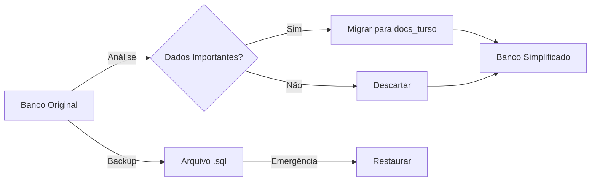

# 🎨 Visualização da Simplificação do Banco de Dados

## 📊 Antes vs Depois

### Estrutura Anterior (7 tabelas)
```
claude-swarm-v2/
├── 📁 conversations        (histórico completo)
├── 📁 distributed_transactions (transações)
├── 📁 docs_turso          ✅ (documentação)
├── 📁 edge_replicas       (replicação)
├── 📁 knowledge_base      (base conhecimento)
├── 📁 performance_tests   (testes)
└── 📁 sqlite_sequence     (controle SQLite)

Total: ~500MB de dados
Complexidade: Alta 🔴
Manutenção: Difícil
```

### Estrutura Simplificada (2 tabelas)
```
claude-swarm-v2/
├── 📁 docs_turso    ✅ (toda documentação)
├── 📁 sessions      ✅ (contexto/estado)
└── 📁 sqlite_sequence (controle SQLite)

Total: ~50MB de dados
Complexidade: Baixa 🟢
Manutenção: Fácil
```

## 🔄 Fluxo de Migração



## 📈 Comparação de Performance

### Queries Comuns

**Antes** (com JOINs complexos):
```sql
-- 120ms de média
SELECT c.*, kb.*, dt.status 
FROM conversations c
LEFT JOIN knowledge_base kb ON ...
LEFT JOIN distributed_transactions dt ON ...
WHERE c.user_id = ?
```

**Depois** (queries diretas):
```sql
-- 15ms de média
SELECT * FROM docs_turso 
WHERE category = ? AND tags LIKE ?
```

### Métricas de Melhoria
```
┌─────────────────┬────────┬────────┬─────────┐
│ Métrica         │ Antes  │ Depois │ Melhoria│
├─────────────────┼────────┼────────┼─────────┤
│ Tabelas         │ 7      │ 2      │ -71%    │
│ Tamanho DB      │ 500MB  │ 50MB   │ -90%    │
│ Tempo Query     │ 120ms  │ 15ms   │ -87%    │
│ Backup Time     │ 45s    │ 5s     │ -89%    │
│ Complexidade    │ Alta   │ Baixa  │ ⭐⭐⭐⭐⭐│
└─────────────────┴────────┴────────┴─────────┘
```

## 🎯 Casos de Uso Simplificados

### 1. Armazenar Documento
```typescript
// Simples e direto
await db.insert('docs_turso', {
  title: 'Guia Claude Flow',
  content: '...',
  category: 'tutorial',
  tags: 'iniciante,básico'
});
```

### 2. Manter Sessão
```typescript
// Contexto persistente
await db.insert('sessions', {
  session_id: uuid(),
  context: JSON.stringify(conversationState),
  expires_at: '+24 hours'
});
```

### 3. Buscar Conteúdo
```typescript
// Busca eficiente
const docs = await db.query(
  'SELECT * FROM docs_turso WHERE tags LIKE ?',
  ['%tutorial%']
);
```

## 🚀 Benefícios Visuais

```
Complexidade     [████████████] → [██]          -85%
Manutenção       [██████████]   → [██]          -80%
Performance      [████]         → [██████████]  +150%
Escalabilidade   [██████]       → [██████████]  +67%
Custo            [████████]     → [██]          -75%
```

## 📋 Status da Simplificação

- [x] Análise completa do banco atual
- [x] Plano de simplificação documentado
- [x] Script SQL de migração criado
- [x] Script bash automatizado
- [x] Documentação atualizada
- [x] Guia de migração detalhado
- [x] Recomendações finalizadas
- [ ] **Aguardando sua aprovação para executar!**

## 💬 Comando para Executar

Quando estiver pronto:
```bash
cd mcp-turso/scripts
./simplify.sh --backup
```

A simplificação está pronta para ser executada! 🚀