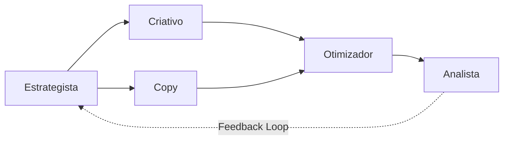
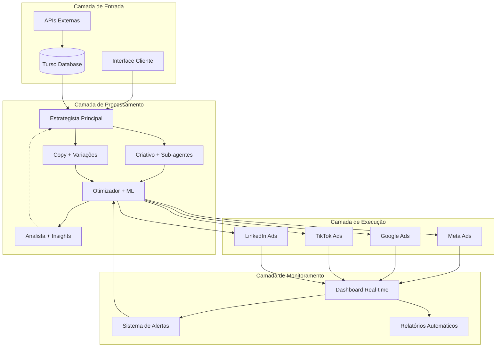

# 🚀 Melhorias Avançadas para Sistema de Agentes de Mídia Paga

## 📊 Estado Atual vs. Visão Futura

### ✅ O que está excelente:
1. **Divisão clara de responsabilidades** - Cada agente tem uma função específica
2. **Workflow sequencial lógico** - O fluxo Estrategista → Criativo → Copy → Otimizador → Analista faz sentido operacional
3. **Comunicação A2A bem definida** - Os dados compartilhados entre agentes estão estruturados
4. **Exemplo prático realista** - ROAS 4.2, CPA R$40, resultados tangíveis

### 🎯 Visão: "Media Buying AI Brain"
Transformar o sistema de uma ferramenta de planejamento para um verdadeiro cérebro de IA capaz de operar campanhas reais com aprendizado contínuo.

## 🔥 10 Melhorias Avançadas

### 1. 🔄 Paralelização de Workflows

**De (Sequencial):**
```
Estrategista → Criativo → Copy → Otimizador → Analista
```

**Para (Paralelo + Híbrido):**


**Implementação:**
```python
# Workflow paralelo com sincronização
async def parallel_creative_workflow():
    strategy = await estrategista.create_briefing()
    
    # Criativo e Copy trabalham em paralelo
    creative_task = asyncio.create_task(
        criativo.create_assets(strategy)
    )
    copy_task = asyncio.create_task(
        copywriter.create_variations(strategy)
    )
    
    # Aguarda ambos antes de otimizar
    creative_assets = await creative_task
    copy_variations = await copy_task
    
    # Otimizador recebe inputs combinados
    await otimizador.optimize_campaign(
        creative_assets, 
        copy_variations
    )
```

### 2. 🔁 Feedback Loops Bidirecionais

**Sistema de Retroalimentação:**
```python
class FeedbackLoop:
    def __init__(self):
        self.performance_threshold = {
            "ctr": 2.0,  # mínimo aceitável
            "roas": 3.0,
            "cpa": 50.0
        }
    
    async def analyze_and_feedback(self, metrics):
        if metrics["ctr"] < self.performance_threshold["ctr"]:
            # Analista envia feedback para Criativo
            await self.send_feedback(
                to="criativo",
                message="CTR baixo - testar novos formatos visuais",
                data={"current_ctr": metrics["ctr"], "target": 2.0}
            )
            
        if metrics["roas"] < self.performance_threshold["roas"]:
            # Analista envia feedback para Estrategista
            await self.send_feedback(
                to="estrategista",
                message="ROAS abaixo do esperado - revisar targeting",
                data={"current_roas": metrics["roas"], "target": 3.0}
            )
```

### 3. 🤖 Sub-agentes Especializados

**Hierarquia de Agentes:**
```yaml
Criativo (Principal):
  sub_agentes:
    - video_specialist:
        foco: "Vídeos 15s, 30s, Reels"
        ferramentas: ["Adobe Premiere API", "Canva API"]
    
    - carousel_expert:
        foco: "Carrosséis multi-slide"
        especialidade: "Storytelling visual"
    
    - stories_creator:
        foco: "Stories interativos"
        features: ["Polls", "Questions", "Stickers"]
    
    - ugc_curator:
        foco: "User Generated Content"
        tarefas: ["Curadoria", "Edição", "Permissões"]
```

**Implementação:**
```python
class CreativeAgent:
    def __init__(self):
        self.sub_agents = {
            "video": VideoSpecialist(),
            "carousel": CarouselExpert(),
            "stories": StoriesCreator(),
            "ugc": UGCCurator()
        }
    
    async def create_campaign_assets(self, briefing):
        # Distribui tarefas para sub-agentes
        tasks = []
        
        if "video" in briefing["formats"]:
            tasks.append(
                self.sub_agents["video"].create_videos(briefing)
            )
            
        if "carousel" in briefing["formats"]:
            tasks.append(
                self.sub_agents["carousel"].create_carousels(briefing)
            )
        
        # Executa todos em paralelo
        results = await asyncio.gather(*tasks)
        return self.combine_assets(results)
```

### 4. 💾 Memória Persistente com Turso

**Schema de Aprendizados:**
```sql
-- Tabela de aprendizados de campanhas
CREATE TABLE campaign_learnings (
    id INTEGER PRIMARY KEY,
    campaign_id TEXT NOT NULL,
    learning_type TEXT, -- 'creative', 'copy', 'audience', 'timing'
    insight TEXT NOT NULL,
    performance_impact REAL,
    confidence_score REAL,
    metadata JSON,
    created_at TIMESTAMP DEFAULT CURRENT_TIMESTAMP
);

-- Tabela de melhores práticas por indústria
CREATE TABLE industry_best_practices (
    id INTEGER PRIMARY KEY,
    industry TEXT NOT NULL,
    practice_type TEXT,
    description TEXT,
    avg_performance JSON,
    sample_size INTEGER,
    last_updated TIMESTAMP
);

-- Tabela de combinações vencedoras
CREATE TABLE winning_combinations (
    id INTEGER PRIMARY KEY,
    creative_type TEXT,
    copy_style TEXT,
    audience_segment TEXT,
    avg_roas REAL,
    avg_ctr REAL,
    times_used INTEGER,
    success_rate REAL
);
```

**Uso da Memória:**
```python
class CampaignMemory:
    def __init__(self, turso_client):
        self.db = turso_client
    
    async def store_learning(self, campaign_id, insight):
        """Armazena aprendizado de campanha"""
        await self.db.execute("""
            INSERT INTO campaign_learnings 
            (campaign_id, learning_type, insight, performance_impact)
            VALUES (?, ?, ?, ?)
        """, [campaign_id, insight.type, insight.text, insight.impact])
    
    async def get_similar_campaigns(self, briefing):
        """Busca campanhas similares para aprender"""
        return await self.db.execute("""
            SELECT * FROM campaign_learnings
            WHERE metadata->>'industry' = ?
            AND metadata->>'objective' = ?
            ORDER BY performance_impact DESC
            LIMIT 10
        """, [briefing.industry, briefing.objective])
```

### 5. 🔌 Integração com APIs Reais

**Conectores de Plataforma:**
```python
class MetaAdsConnector:
    def __init__(self, access_token):
        self.api = MetaAdsAPI(access_token)
        self.account_id = None
    
    async def create_campaign(self, strategy):
        """Cria campanha real no Meta"""
        campaign = await self.api.campaigns.create({
            "name": strategy["name"],
            "objective": strategy["objective"],
            "status": "PAUSED",  # Sempre criar pausada
            "special_ad_categories": []
        })
        return campaign.id
    
    async def upload_creative(self, asset):
        """Upload de criativo"""
        if asset["type"] == "video":
            video_id = await self.api.videos.upload(asset["file"])
            return await self.api.ad_creatives.create({
                "video_id": video_id,
                "thumbnail_url": asset["thumbnail"]
            })
        
    async def set_targeting(self, audience_params):
        """Define público-alvo"""
        return await self.api.targeting.create({
            "geo_locations": audience_params["locations"],
            "age_min": audience_params["age_min"],
            "age_max": audience_params["age_max"],
            "interests": audience_params["interests"],
            "behaviors": audience_params["behaviors"],
            "custom_audiences": audience_params["custom_audiences"]
        })
```

### 6. 🧠 Machine Learning para Previsões

**Modelo de Previsão de Performance:**
```python
import numpy as np
from sklearn.ensemble import RandomForestRegressor
import joblib

class PerformancePredictor:
    def __init__(self):
        self.roas_model = joblib.load('models/roas_predictor.pkl')
        self.saturation_model = joblib.load('models/audience_saturation.pkl')
    
    def predict_roas(self, campaign_features):
        """Prevê ROAS baseado em características da campanha"""
        features = self.extract_features(campaign_features)
        
        # Features: industry, objective, budget, audience_size, 
        # creative_type, seasonality, competition_level
        predicted_roas = self.roas_model.predict([features])[0]
        confidence_interval = self.calculate_confidence(features)
        
        return {
            "predicted_roas": predicted_roas,
            "confidence_interval": confidence_interval,
            "recommendation": self.generate_recommendation(predicted_roas)
        }
    
    def predict_audience_saturation(self, audience_data, frequency):
        """Prevê quando audiência ficará saturada"""
        days_to_saturation = self.saturation_model.predict([
            audience_data["size"],
            audience_data["overlap_percentage"],
            frequency["current"],
            frequency["growth_rate"]
        ])[0]
        
        return {
            "days_to_saturation": days_to_saturation,
            "recommended_action": "expand_audience" if days_to_saturation < 7 else "maintain"
        }
```

### 7. 👥 Sistema de Personas Dinâmicas

**Personas Baseadas em Dados Reais:**
```python
class DynamicPersonaBuilder:
    def __init__(self, analytics_client, social_client):
        self.analytics = analytics_client
        self.social = social_client
    
    async def build_data_driven_personas(self, brand):
        """Constrói personas baseadas em dados reais"""
        
        # 1. Dados do Google Analytics
        ga_data = await self.analytics.get_audience_data(brand)
        
        # 2. Dados sociais (Instagram/Facebook)
        social_data = await self.social.get_follower_insights(brand)
        
        # 3. Dados de compra
        purchase_data = await self.get_purchase_patterns(brand)
        
        # 4. Clustering para identificar grupos
        personas = self.cluster_audiences(ga_data, social_data, purchase_data)
        
        return [
            {
                "name": f"Persona {i+1}",
                "demographics": persona["demographics"],
                "psychographics": persona["interests"],
                "behavior": {
                    "online_hours": persona["active_hours"],
                    "preferred_content": persona["content_preferences"],
                    "purchase_triggers": persona["triggers"]
                },
                "size": persona["cluster_size"],
                "value": persona["estimated_ltv"]
            }
            for i, persona in enumerate(personas)
        ]
```

### 8. 🔬 Sistema Avançado de A/B Testing

**Testing Automatizado e Estatisticamente Significativo:**
```python
class AdvancedABTesting:
    def __init__(self):
        self.min_sample_size = 1000
        self.confidence_level = 0.95
    
    async def create_test_matrix(self, campaign):
        """Cria matriz de testes multivariada"""
        test_matrix = {
            "creatives": campaign.creative_variations,
            "copy": campaign.copy_variations,
            "audiences": campaign.audience_segments,
            "placements": campaign.placements,
            "bidding": ["lowest_cost", "cost_cap", "bid_cap"]
        }
        
        # Gera combinações inteligentes (não todas)
        smart_combinations = self.generate_smart_combinations(test_matrix)
        
        return smart_combinations
    
    def calculate_statistical_significance(self, control, variant):
        """Calcula significância estatística"""
        from scipy import stats
        
        # Teste t de Student
        t_stat, p_value = stats.ttest_ind(
            control["conversions"],
            variant["conversions"]
        )
        
        # Cálculo do tamanho do efeito (Cohen's d)
        cohens_d = (np.mean(variant["conversions"]) - np.mean(control["conversions"])) / \
                   np.sqrt((np.std(control["conversions"])**2 + np.std(variant["conversions"])**2) / 2)
        
        return {
            "is_significant": p_value < 0.05,
            "p_value": p_value,
            "effect_size": cohens_d,
            "confidence": 1 - p_value,
            "recommendation": self.get_recommendation(p_value, cohens_d)
        }
    
    async def auto_apply_winner(self, test_results):
        """Aplica automaticamente a variação vencedora"""
        if test_results["is_significant"] and test_results["effect_size"] > 0.3:
            await self.pause_losing_variants()
            await self.scale_winning_variant()
            await self.notify_team(test_results)
```

### 9. 🌐 Multi-Platform Orchestration

**Orquestração entre Plataformas:**
```python
class MultiPlatformOrchestrator:
    def __init__(self):
        self.platforms = {
            "meta": MetaAdsConnector(),
            "google": GoogleAdsConnector(),
            "tiktok": TikTokAdsConnector(),
            "linkedin": LinkedInAdsConnector()
        }
    
    async def orchestrate_cross_platform_campaign(self, strategy):
        """Orquestra campanha em múltiplas plataformas"""
        
        # 1. Aloca budget por plataforma baseado em histórico
        budget_allocation = await self.smart_budget_allocation(strategy)
        
        # 2. Adapta criativos para cada plataforma
        platform_creatives = {}
        for platform in self.platforms:
            platform_creatives[platform] = await self.adapt_creative_for_platform(
                strategy["creatives"],
                platform
            )
        
        # 3. Sincroniza lançamento
        launch_tasks = []
        for platform, connector in self.platforms.items():
            if budget_allocation[platform] > 0:
                launch_tasks.append(
                    self.launch_on_platform(
                        connector,
                        strategy,
                        platform_creatives[platform],
                        budget_allocation[platform]
                    )
                )
        
        # 4. Lança simultaneamente
        results = await asyncio.gather(*launch_tasks)
        
        # 5. Monitora performance unificada
        await self.unified_performance_monitoring(results)
    
    def adapt_creative_for_platform(self, creative, platform):
        """Adapta criativo para especificações da plataforma"""
        adaptations = {
            "meta": {
                "video_length": 15,
                "aspect_ratios": ["1:1", "4:5", "9:16"],
                "safe_zones": True
            },
            "tiktok": {
                "video_length": 30,
                "aspect_ratios": ["9:16"],
                "native_feel": True,
                "trending_audio": True
            },
            "linkedin": {
                "professional_tone": True,
                "b2b_focus": True,
                "aspect_ratios": ["1:1", "16:9"]
            }
        }
        
        return self.apply_adaptations(creative, adaptations[platform])
```

### 10. 📊 Dashboard Real-time com Alertas Inteligentes

**Sistema de Monitoramento Ativo:**
```python
class RealTimeDashboard:
    def __init__(self, notification_service):
        self.alerts = notification_service
        self.websocket_clients = []
        self.alert_rules = self.load_alert_rules()
    
    async def monitor_campaigns(self):
        """Monitor contínuo de campanhas"""
        while True:
            metrics = await self.fetch_current_metrics()
            
            # Verifica alertas
            alerts = self.check_alert_conditions(metrics)
            
            # Envia notificações
            for alert in alerts:
                await self.handle_alert(alert)
            
            # Atualiza dashboard via WebSocket
            await self.broadcast_update(metrics)
            
            # Aguarda próximo ciclo (1 minuto)
            await asyncio.sleep(60)
    
    def check_alert_conditions(self, metrics):
        """Verifica condições de alerta"""
        alerts = []
        
        # CPM subindo rapidamente
        if metrics["cpm_growth_rate"] > 20:  # >20% em 1 hora
            alerts.append({
                "type": "cost_spike",
                "severity": "high",
                "message": f"CPM aumentou {metrics['cpm_growth_rate']}% na última hora",
                "recommendation": "Verificar competição e ajustar lances"
            })
        
        # Performance caindo
        if metrics["roas"] < metrics["roas_target"] * 0.8:
            alerts.append({
                "type": "performance_drop",
                "severity": "critical",
                "message": f"ROAS em {metrics['roas']}, abaixo do target",
                "recommendation": "Pausar ads com baixa performance"
            })
        
        # Oportunidade detectada
        if metrics["available_audience"] > metrics["current_audience"] * 2:
            alerts.append({
                "type": "opportunity",
                "severity": "info",
                "message": "Audiência potencial 2x maior disponível",
                "recommendation": "Expandir targeting gradualmente"
            })
        
        return alerts
    
    async def auto_optimization(self, alert):
        """Otimização automática baseada em alertas"""
        if alert["type"] == "cost_spike" and alert["severity"] == "high":
            # Reduz lances automaticamente
            await self.reduce_bids(percentage=10)
            
        elif alert["type"] == "performance_drop" and alert["severity"] == "critical":
            # Pausa ads com pior performance
            worst_performers = await self.identify_worst_performers(n=3)
            await self.pause_ads(worst_performers)
            
            # Realoca budget para melhores performers
            await self.reallocate_budget()
```

## 🎯 Arquitetura Integrada Final



## 🚀 Implementação Progressiva

### Fase 1 (Mês 1-2): Fundação
- ✅ Implementar paralelização básica
- ✅ Adicionar feedback loops
- ✅ Integrar Turso para memória

### Fase 2 (Mês 3-4): Integrações
- 🔄 Conectar APIs Meta/Google
- 🔄 Implementar A/B testing básico
- 🔄 Dashboard inicial

### Fase 3 (Mês 5-6): Inteligência
- 🎯 Machine Learning predictions
- 🎯 Sub-agentes especializados
- 🎯 Otimização automática

### Fase 4 (Mês 7-8): Escala
- 🚀 Multi-platform orchestration
- 🚀 Sistema completo de alertas
- 🚀 Personas dinâmicas

## 💰 ROI Esperado

Com todas as melhorias implementadas:
- **Redução de 60%** no tempo de setup de campanhas
- **Aumento de 40%** no ROAS médio
- **Redução de 50%** no tempo de reação a mudanças
- **Escala 10x** na capacidade de gestão simultânea

O sistema evoluiria de uma ferramenta de planejamento para um verdadeiro "Media Buying AI Brain" capaz de operar campanhas reais com aprendizado contínuo! 🚀
