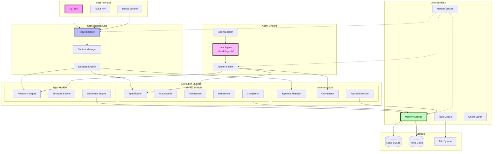
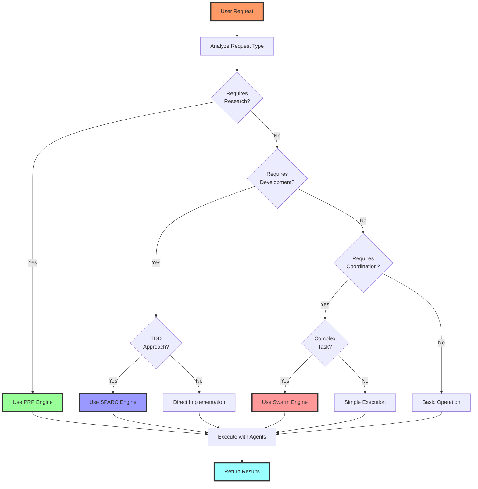
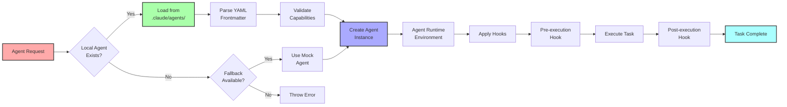
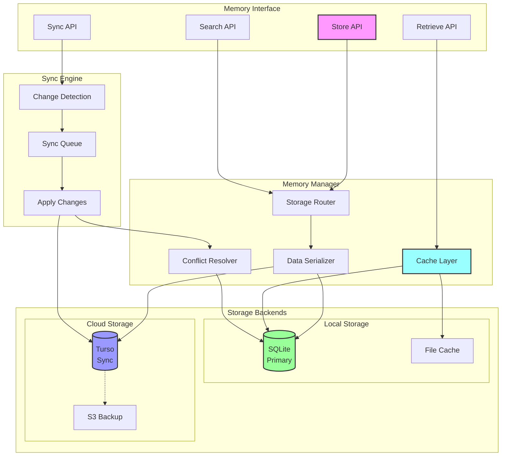
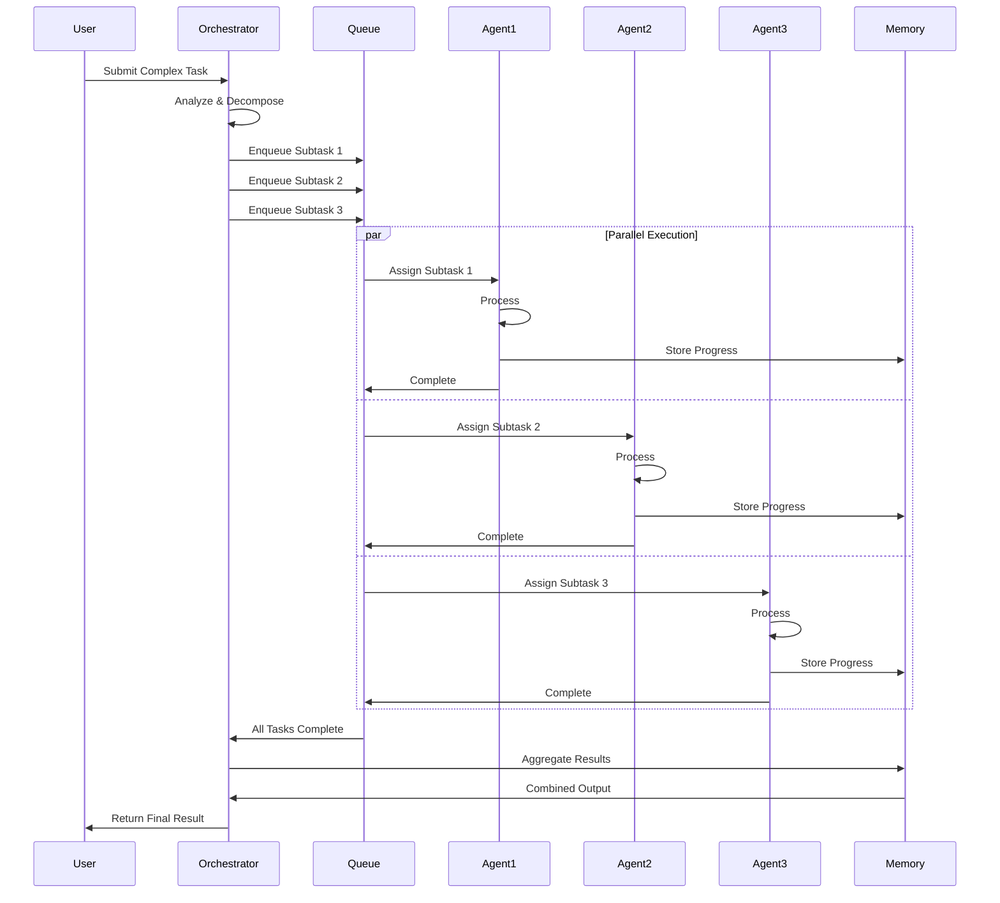
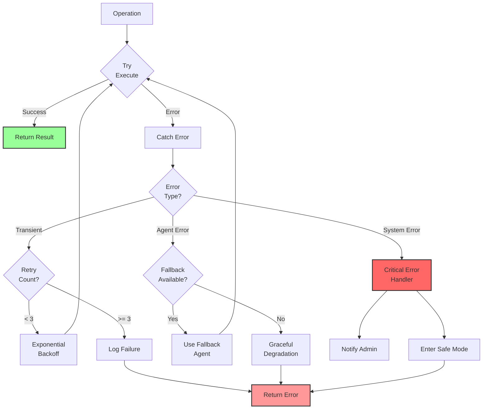
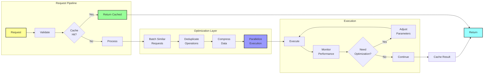
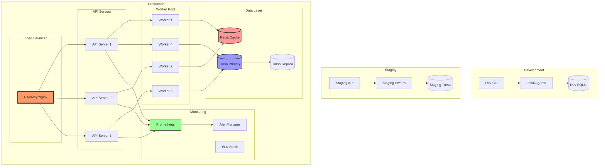

# 📊 Diagramas de Arquitetura Detalhados

## 1. Visão de Componentes

## 2. Fluxo de Decisão

## 3. Agent Resolution Flow

## 4. Memory System Architecture

## 5. Parallel Execution Pattern

## 6. Error Handling Flow

## 7. Performance Optimization

## 8. Deployment Architecture

---

*Diagramas criados para complementar a arquitetura simplificada*
*Architecture Agent - SPARC Phase 3*