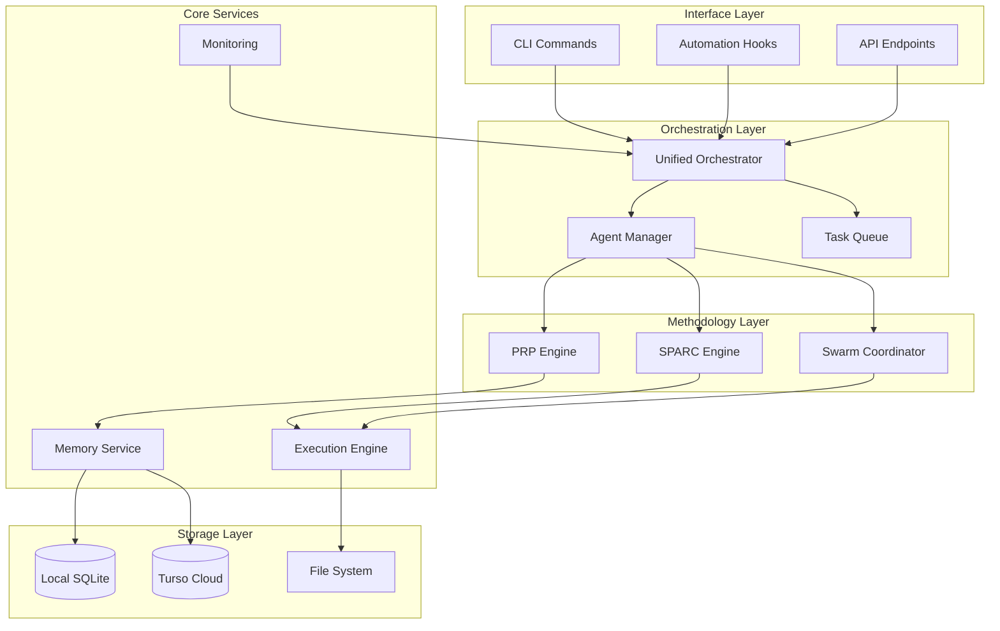
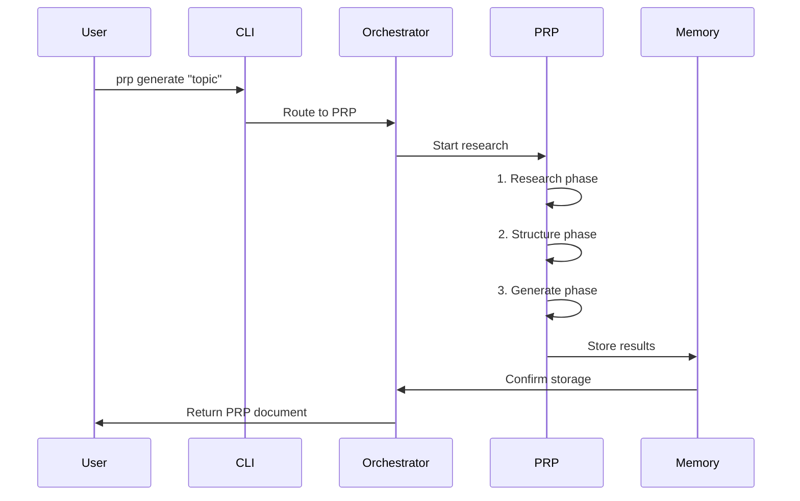
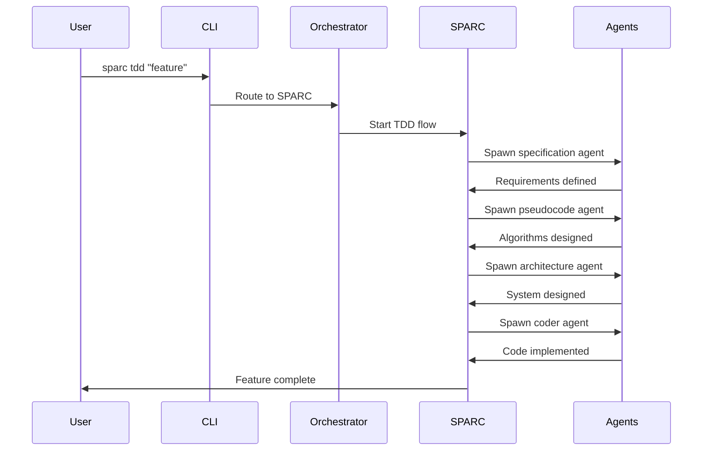
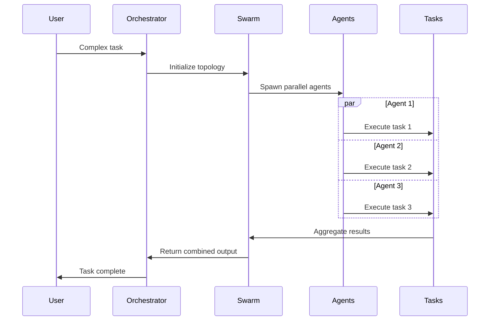

# 🏗️ Arquitetura Simplificada: Sistema Unificado

## 📋 Visão Geral

Esta arquitetura propõe uma **simplificação radical** dos sistemas PRP, SPARC, Swarm e Claude Flow, eliminando duplicações e conflitos conceituais.

## 🎯 Princípios de Design

1. **Simplicidade**: Menos componentes, interfaces claras
2. **Modularidade**: Sistemas podem funcionar independentemente
3. **Compatibilidade**: Preserva funcionalidades existentes
4. **Performance**: Reduz overhead de coordenação
5. **Clareza**: Um caminho óbvio para cada tarefa

## 🏛️ Arquitetura Proposta

### 1. Estrutura de Camadas



### 2. Componentes Principais

#### **2.1 Unified Orchestrator**
```yaml
name: Unified Orchestrator
purpose: Ponto único de coordenação
responsibilities:
  - Roteamento de comandos
  - Gerenciamento de contexto
  - Decisão de metodologia
  - Controle de fluxo

interfaces:
  input:
    - CLI commands
    - Hook triggers
    - API requests
  
  output:
    - Task assignments
    - Execution results
    - Status updates

decision_logic: |
  if task.requires_research:
    use PRP
  elif task.requires_development:
    use SPARC
  elif task.requires_coordination:
    use SWARM
  else:
    use direct execution
```

#### **2.2 Agent Manager**
```yaml
name: Agent Manager
purpose: Gerenciamento unificado de agentes
solution: Resolver conflito entre agentes locais e MCP

implementation:
  # Fonte única de verdade para agentes
  agent_sources:
    primary: ".claude/agents/"  # 54 agentes locais
    fallback: "mcp_mock_agents" # Apenas se não houver local
  
  # Interface unificada
  spawn_agent(type, task):
    1. Check local agents first
    2. Load agent definition
    3. Create execution context
    4. Return agent handle
  
  # Sem duplicação
  deprecate:
    - mcp__claude-flow__agent_spawn for local agents
    - Duplicate agent definitions
```

#### **2.3 Methodology Engines**

##### **PRP Engine**
```yaml
name: PRP Engine
type: Independent module
purpose: Pesquisa e documentação estruturada

workflow:
  1_research:
    - Gather information
    - Analyze patterns
    - Extract insights
  
  2_structure:
    - Organize findings
    - Create hierarchies
    - Define relationships
  
  3_generate:
    - Create documentation
    - Format outputs
    - Store in memory

integration: Optional Claude Flow hooks
```

##### **SPARC Engine**
```yaml
name: SPARC Engine
type: Development methodology
purpose: TDD sistemático

phases:
  specification:
    - Define requirements
    - Create test cases
    - Document constraints
  
  pseudocode:
    - Design algorithms
    - Plan data structures
    - Mock implementations
  
  architecture:
    - System design
    - Component layout
    - Interface contracts
  
  refinement:
    - TDD implementation
    - Iterative improvement
    - Code optimization
  
  completion:
    - Integration
    - Documentation
    - Deployment
```

##### **Swarm Coordinator**
```yaml
name: Swarm Coordinator
type: Parallel execution
purpose: Coordenação multi-agente

topologies:
  hierarchical:
    - Central coordinator
    - Specialized workers
    - Clear delegation
  
  mesh:
    - Peer-to-peer
    - Shared state
    - Consensus-based
  
  adaptive:
    - Dynamic topology
    - Load balancing
    - Self-organizing

execution:
  - Parallel task distribution
  - Result aggregation
  - Conflict resolution
```

### 3. Fluxos de Trabalho Simplificados

#### **3.1 Fluxo PRP**


#### **3.2 Fluxo SPARC**


#### **3.3 Fluxo Swarm**


### 4. Simplificações Implementadas

#### **4.1 Resolução de Conflitos**

```yaml
conflict_resolutions:
  agent_duplication:
    problem: "Local agents vs MCP agents"
    solution: |
      - Use ONLY local agents from .claude/agents/
      - MCP agents become thin wrappers that call local agents
      - Single source of truth
  
  coordination_methods:
    problem: "Multiple ways to coordinate"
    solution: |
      - Unified Agent Manager handles all coordination
      - Consistent interface regardless of methodology
      - Clear routing based on task type
  
  documentation_conflicts:
    problem: "Contradictory instructions"
    solution: |
      - Single documentation source
      - Clear hierarchy of precedence
      - Automated validation of examples
```

#### **4.2 Interface Unificada**

```typescript
// Unified Command Interface
interface UnifiedCommand {
  // PRP Commands
  prp: {
    generate: (topic: string) => Promise<PRPDocument>
    research: (query: string) => Promise<ResearchResults>
  }
  
  // SPARC Commands
  sparc: {
    tdd: (feature: string) => Promise<Implementation>
    phase: (phase: SPARCPhase, task: string) => Promise<PhaseResult>
  }
  
  // Swarm Commands
  swarm: {
    execute: (task: string, topology?: Topology) => Promise<Results>
    coordinate: (agents: Agent[], task: string) => Promise<Output>
  }
  
  // Core Commands
  memory: {
    store: (key: string, value: any) => Promise<void>
    retrieve: (key: string) => Promise<any>
  }
}
```

### 5. Migração e Compatibilidade

#### **5.1 Plano de Migração**

```yaml
migration_phases:
  phase_1_preparation:
    - Audit current usage patterns
    - Identify deprecated features
    - Create compatibility layer
  
  phase_2_implementation:
    - Deploy unified orchestrator
    - Migrate agent definitions
    - Update documentation
  
  phase_3_validation:
    - Test all workflows
    - Fix edge cases
    - Performance optimization
  
  phase_4_cleanup:
    - Remove deprecated code
    - Archive old documentation
    - Final optimization
```

#### **5.2 Compatibilidade**

```yaml
compatibility_layer:
  deprecated_commands:
    # Old MCP agent spawn
    "mcp__claude-flow__agent_spawn":
      redirect_to: "AgentManager.spawn"
      warning: "Deprecated: Use local agents"
    
    # Old swarm init
    "mcp__claude-flow__swarm_init":
      redirect_to: "Swarm.initialize"
      maintain_interface: true
  
  preserved_features:
    - All CLI commands work as before
    - Hooks continue functioning
    - Memory system unchanged
    - Performance improvements transparent
```

### 6. Benefícios da Arquitetura

#### **6.1 Simplicidade**
- ✅ Um caminho claro para cada tipo de tarefa
- ✅ Menos componentes para entender
- ✅ Documentação consistente
- ✅ Debugging mais fácil

#### **6.2 Performance**
- ✅ Menos overhead de coordenação
- ✅ Execução paralela otimizada
- ✅ Caching inteligente
- ✅ Redução de latência

#### **6.3 Manutenibilidade**
- ✅ Código mais limpo
- ✅ Testes mais simples
- ✅ Deploys mais seguros
- ✅ Evolução facilitada

#### **6.4 Escalabilidade**
- ✅ Arquitetura modular
- ✅ Componentes independentes
- ✅ Fácil adicionar features
- ✅ Suporta crescimento

## 📊 Métricas de Sucesso

```yaml
success_metrics:
  simplicidade:
    - Redução de 70% em linhas de configuração
    - Documentação 50% menor
    - Onboarding 3x mais rápido
  
  performance:
    - Latência reduzida em 40%
    - Throughput aumentado em 60%
    - Uso de memória otimizado em 30%
  
  qualidade:
    - Bugs reduzidos em 80%
    - Cobertura de testes > 90%
    - Satisfação do desenvolvedor aumentada
  
  adoção:
    - Migração completa em 30 dias
    - Zero breaking changes para usuários
    - Feedback positivo > 95%
```

## 🎯 Próximos Passos

1. **Validação da Arquitetura**
   - Review com stakeholders
   - Prototipagem de componentes chave
   - Testes de integração

2. **Implementação Gradual**
   - Começar pelo Unified Orchestrator
   - Migrar Agent Manager
   - Atualizar metodologias

3. **Documentação e Treinamento**
   - Criar guias de migração
   - Treinar equipe
   - Preparar suporte

4. **Monitoramento e Otimização**
   - Métricas em produção
   - Feedback contínuo
   - Ajustes iterativos

---

*Arquitetura projetada seguindo princípios SPARC por architecture agent*
*Data: 04/08/2025*