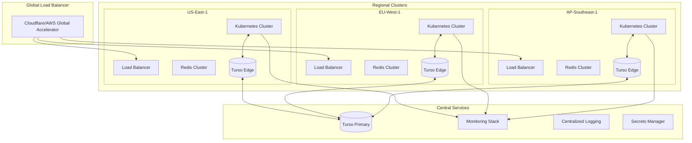

# 🚀 Guia de Deployment e Configuração em Produção

## Visão Geral

Este guia detalha o processo completo de deployment do sistema Claude Flow + Turso + Swarm em ambiente de produção, incluindo configurações de segurança, escalabilidade e monitoramento.

## 📋 Índice

1. [Pré-requisitos](#pré-requisitos)
2. [Arquitetura de Produção](#arquitetura-de-produção)
3. [Configuração de Infraestrutura](#configuração-de-infraestrutura)
4. [Deployment do Turso Edge](#deployment-do-turso-edge)
5. [Deployment do Claude Flow Swarm](#deployment-do-claude-flow-swarm)
6. [Configurações de Segurança](#configurações-de-segurança)
7. [Monitoramento e Observabilidade](#monitoramento-e-observabilidade)
8. [CI/CD Pipeline](#cicd-pipeline)
9. [Disaster Recovery](#disaster-recovery)
10. [Checklist de Produção](#checklist-de-produção)

## 🔧 Pré-requisitos

### Ferramentas Necessárias

```bash
# Verificar versões
node --version      # >= 18.0.0
npm --version       # >= 9.0.0
docker --version    # >= 24.0.0
kubectl version     # >= 1.28.0
terraform --version # >= 1.6.0
```

### Contas e Acessos

- **Turso Account**: https://turso.tech
- **Cloud Provider**: AWS/GCP/Azure
- **Container Registry**: Docker Hub/ECR/GCR
- **Monitoring**: Datadog/New Relic/Prometheus
- **DNS Provider**: Route53/Cloudflare

## 🏗️ Arquitetura de Produção



## 🌐 Configuração de Infraestrutura

### 1. Terraform Configuration

```hcl
# terraform/main.tf
terraform {
  required_version = ">= 1.6.0"
  
  required_providers {
    aws = {
      source  = "hashicorp/aws"
      version = "~> 5.0"
    }
    kubernetes = {
      source  = "hashicorp/kubernetes"
      version = "~> 2.24"
    }
  }
  
  backend "s3" {
    bucket = "claude-flow-terraform-state"
    key    = "production/terraform.tfstate"
    region = "us-east-1"
  }
}

# VPC Configuration
module "vpc" {
  source = "./modules/vpc"
  
  for_each = var.regions
  
  cidr_block           = each.value.cidr
  availability_zones   = each.value.azs
  enable_nat_gateway   = true
  enable_vpn_gateway   = true
  enable_dns_hostnames = true
  
  tags = {
    Environment = "production"
    Region      = each.key
  }
}

# EKS Clusters
module "eks" {
  source = "./modules/eks"
  
  for_each = var.regions
  
  cluster_name    = "claude-flow-${each.key}"
  cluster_version = "1.28"
  
  vpc_id     = module.vpc[each.key].vpc_id
  subnet_ids = module.vpc[each.key].private_subnet_ids
  
  node_groups = {
    general = {
      desired_capacity = 3
      max_capacity     = 10
      min_capacity     = 3
      instance_types   = ["m5.xlarge"]
    }
    
    swarm = {
      desired_capacity = 5
      max_capacity     = 20
      min_capacity     = 5
      instance_types   = ["c5.2xlarge"]
      
      labels = {
        workload = "swarm-agents"
      }
      
      taints = [{
        key    = "swarm"
        value  = "true"
        effect = "NO_SCHEDULE"
      }]
    }
  }
}

# Redis Clusters
module "redis" {
  source = "./modules/elasticache"
  
  for_each = var.regions
  
  cluster_id           = "claude-flow-cache-${each.key}"
  node_type           = "cache.r6g.xlarge"
  num_cache_nodes     = 3
  parameter_group_name = "default.redis7.cluster.on"
  
  subnet_group_name = module.vpc[each.key].elasticache_subnet_group_name
  security_group_ids = [module.vpc[each.key].redis_security_group_id]
}
```

### 2. Kubernetes Base Configuration

```yaml
# k8s/namespace.yaml
apiVersion: v1
kind: Namespace
metadata:
  name: claude-flow-production
  labels:
    environment: production
    
---
# k8s/resource-quotas.yaml
apiVersion: v1
kind: ResourceQuota
metadata:
  name: production-quota
  namespace: claude-flow-production
spec:
  hard:
    requests.cpu: "100"
    requests.memory: "200Gi"
    limits.cpu: "200"
    limits.memory: "400Gi"
    persistentvolumeclaims: "10"
    services.loadbalancers: "5"
```

## 🗄️ Deployment do Turso Edge

### 1. Criar Banco de Dados Turso

```bash
# Login no Turso
turso auth login

# Criar organização
turso org create claude-flow-prod

# Criar banco principal
turso db create claude-flow-main --org claude-flow-prod

# Criar réplicas regionais
turso db replicate claude-flow-main us-east-1 --org claude-flow-prod
turso db replicate claude-flow-main eu-west-1 --org claude-flow-prod
turso db replicate claude-flow-main ap-southeast-1 --org claude-flow-prod
turso db replicate claude-flow-main sa-east-1 --org claude-flow-prod

# Obter URLs de conexão
turso db show claude-flow-main --org claude-flow-prod
```

### 2. Schema Migration

```sql
-- migrations/001_initial_schema.sql
-- Tabelas principais
CREATE TABLE IF NOT EXISTS users (
    id TEXT PRIMARY KEY,
    email TEXT UNIQUE NOT NULL,
    password_hash TEXT NOT NULL,
    full_name TEXT,
    region TEXT,
    created_at INTEGER,
    updated_at INTEGER,
    last_login INTEGER,
    is_active BOOLEAN DEFAULT TRUE,
    metadata TEXT
);

CREATE TABLE IF NOT EXISTS products (
    id TEXT PRIMARY KEY,
    name TEXT NOT NULL,
    description TEXT,
    price DECIMAL(10,2),
    stock INTEGER,
    category TEXT,
    image_url TEXT,
    created_at INTEGER,
    updated_at INTEGER
);

CREATE TABLE IF NOT EXISTS orders (
    id TEXT PRIMARY KEY,
    user_id TEXT NOT NULL,
    items TEXT NOT NULL, -- JSON
    total DECIMAL(10,2),
    status TEXT,
    payment_id TEXT,
    region TEXT,
    created_at INTEGER,
    updated_at INTEGER,
    FOREIGN KEY (user_id) REFERENCES users(id)
);

-- Índices para performance
CREATE INDEX idx_users_email ON users(email);
CREATE INDEX idx_orders_user ON orders(user_id);
CREATE INDEX idx_orders_status ON orders(status);
CREATE INDEX idx_products_category ON products(category);

-- Tabelas CRDT para sincronização
CREATE TABLE IF NOT EXISTS crdt_vector_clocks (
    node_id TEXT PRIMARY KEY,
    clock INTEGER DEFAULT 0,
    last_update INTEGER DEFAULT 0
);

CREATE TABLE IF NOT EXISTS crdt_operations (
    id TEXT PRIMARY KEY,
    node_id TEXT,
    operation_type TEXT,
    entity_type TEXT,
    entity_id TEXT,
    data TEXT,
    vector_clock TEXT,
    timestamp INTEGER,
    applied BOOLEAN DEFAULT FALSE
);
```

### 3. Configuração de Conexão

```typescript
// config/turso.config.ts
export const tursoConfig = {
  production: {
    primary: {
      url: process.env.TURSO_PRIMARY_URL!,
      authToken: process.env.TURSO_AUTH_TOKEN!
    },
    replicas: {
      'us-east-1': {
        url: process.env.TURSO_US_EAST_URL!,
        authToken: process.env.TURSO_AUTH_TOKEN!
      },
      'eu-west-1': {
        url: process.env.TURSO_EU_WEST_URL!,
        authToken: process.env.TURSO_AUTH_TOKEN!
      },
      'ap-southeast-1': {
        url: process.env.TURSO_AP_SOUTHEAST_URL!,
        authToken: process.env.TURSO_AUTH_TOKEN!
      },
      'sa-east-1': {
        url: process.env.TURSO_SA_EAST_URL!,
        authToken: process.env.TURSO_AUTH_TOKEN!
      }
    },
    syncStrategy: 'crdt',
    consistency: 'eventual',
    maxLatency: 50,
    connectionPool: {
      max: 20,
      min: 5,
      acquireTimeout: 30000,
      idleTimeout: 600000
    }
  }
};
```

## 🐝 Deployment do Claude Flow Swarm

### 1. Docker Images

```dockerfile
# Dockerfile.swarm-base
FROM node:20-alpine AS base

RUN apk add --no-cache \
    python3 \
    make \
    g++ \
    git

WORKDIR /app

# Dependencies
COPY package*.json ./
RUN npm ci --production

# Application
COPY . .
RUN npm run build

# Runtime
FROM node:20-alpine
RUN apk add --no-cache tini
WORKDIR /app

COPY --from=base /app/node_modules ./node_modules
COPY --from=base /app/dist ./dist
COPY --from=base /app/package*.json ./

ENV NODE_ENV=production
EXPOSE 3000

ENTRYPOINT ["/sbin/tini", "--"]
CMD ["node", "dist/index.js"]
```

### 2. Kubernetes Deployments

```yaml
# k8s/deployments/swarm-coordinator.yaml
apiVersion: apps/v1
kind: Deployment
metadata:
  name: swarm-coordinator
  namespace: claude-flow-production
spec:
  replicas: 3
  selector:
    matchLabels:
      app: swarm-coordinator
  template:
    metadata:
      labels:
        app: swarm-coordinator
    spec:
      serviceAccountName: swarm-coordinator
      containers:
      - name: coordinator
        image: claude-flow/swarm-coordinator:v1.0.0
        ports:
        - containerPort: 3000
        env:
        - name: NODE_ENV
          value: "production"
        - name: SWARM_TOPOLOGY
          value: "hierarchical"
        - name: MAX_AGENTS
          value: "50"
        - name: TURSO_PRIMARY_URL
          valueFrom:
            secretKeyRef:
              name: turso-credentials
              key: primary-url
        - name: TURSO_AUTH_TOKEN
          valueFrom:
            secretKeyRef:
              name: turso-credentials
              key: auth-token
        - name: REDIS_URL
          valueFrom:
            secretKeyRef:
              name: redis-credentials
              key: connection-string
        resources:
          requests:
            memory: "2Gi"
            cpu: "1000m"
          limits:
            memory: "4Gi"
            cpu: "2000m"
        livenessProbe:
          httpGet:
            path: /health
            port: 3000
          initialDelaySeconds: 30
          periodSeconds: 10
        readinessProbe:
          httpGet:
            path: /ready
            port: 3000
          initialDelaySeconds: 20
          periodSeconds: 5
      affinity:
        podAntiAffinity:
          requiredDuringSchedulingIgnoredDuringExecution:
          - labelSelector:
              matchExpressions:
              - key: app
                operator: In
                values:
                - swarm-coordinator
            topologyKey: kubernetes.io/hostname

---
# k8s/deployments/swarm-agents.yaml
apiVersion: apps/v1
kind: StatefulSet
metadata:
  name: swarm-agents
  namespace: claude-flow-production
spec:
  serviceName: swarm-agents
  replicas: 10
  selector:
    matchLabels:
      app: swarm-agent
  template:
    metadata:
      labels:
        app: swarm-agent
    spec:
      containers:
      - name: agent
        image: claude-flow/swarm-agent:v1.0.0
        env:
        - name: AGENT_TYPE
          valueFrom:
            fieldRef:
              fieldPath: metadata.annotations['agent-type']
        - name: COORDINATOR_URL
          value: "http://swarm-coordinator:3000"
        resources:
          requests:
            memory: "1Gi"
            cpu: "500m"
          limits:
            memory: "2Gi"
            cpu: "1000m"
      tolerations:
      - key: "swarm"
        operator: "Equal"
        value: "true"
        effect: "NoSchedule"
      nodeSelector:
        workload: swarm-agents
```

### 3. Services and Ingress

```yaml
# k8s/services/api-service.yaml
apiVersion: v1
kind: Service
metadata:
  name: claude-flow-api
  namespace: claude-flow-production
spec:
  type: ClusterIP
  ports:
  - port: 80
    targetPort: 3000
    protocol: TCP
  selector:
    app: api-server

---
# k8s/ingress/main-ingress.yaml
apiVersion: networking.k8s.io/v1
kind: Ingress
metadata:
  name: claude-flow-ingress
  namespace: claude-flow-production
  annotations:
    kubernetes.io/ingress.class: nginx
    cert-manager.io/cluster-issuer: letsencrypt-prod
    nginx.ingress.kubernetes.io/rate-limit: "100"
    nginx.ingress.kubernetes.io/proxy-body-size: "10m"
spec:
  tls:
  - hosts:
    - api.claude-flow.io
    secretName: claude-flow-tls
  rules:
  - host: api.claude-flow.io
    http:
      paths:
      - path: /
        pathType: Prefix
        backend:
          service:
            name: claude-flow-api
            port:
              number: 80
```

## 🔒 Configurações de Segurança

### 1. Network Policies

```yaml
# k8s/network-policies/api-policy.yaml
apiVersion: networking.k8s.io/v1
kind: NetworkPolicy
metadata:
  name: api-network-policy
  namespace: claude-flow-production
spec:
  podSelector:
    matchLabels:
      app: api-server
  policyTypes:
  - Ingress
  - Egress
  ingress:
  - from:
    - namespaceSelector:
        matchLabels:
          name: ingress-nginx
    ports:
    - protocol: TCP
      port: 3000
  egress:
  - to:
    - podSelector:
        matchLabels:
          app: swarm-coordinator
  - to:
    - namespaceSelector: {}
      podSelector:
        matchLabels:
          app: redis
  - ports:
    - protocol: TCP
      port: 443 # Turso connections
    - protocol: TCP
      port: 53  # DNS
```

### 2. Secrets Management

```yaml
# k8s/secrets/sealed-secrets.yaml
apiVersion: bitnami.com/v1alpha1
kind: SealedSecret
metadata:
  name: turso-credentials
  namespace: claude-flow-production
spec:
  encryptedData:
    primary-url: AgBvL3RoaXMgaXMgYSBzZWFsZWQgc2VjcmV0...
    auth-token: AgCYWx1ZS1mbG93LXByb2R1Y3Rpb24tc2Vj...

---
apiVersion: bitnami.com/v1alpha1
kind: SealedSecret
metadata:
  name: jwt-secret
  namespace: claude-flow-production
spec:
  encryptedData:
    secret: AgDc3VwZXItc2VjcmV0LWp3dC1rZXktZm9y...
```

### 3. RBAC Configuration

```yaml
# k8s/rbac/service-accounts.yaml
apiVersion: v1
kind: ServiceAccount
metadata:
  name: swarm-coordinator
  namespace: claude-flow-production

---
apiVersion: rbac.authorization.k8s.io/v1
kind: Role
metadata:
  name: swarm-coordinator-role
  namespace: claude-flow-production
rules:
- apiGroups: [""]
  resources: ["pods", "services"]
  verbs: ["get", "list", "watch"]
- apiGroups: ["apps"]
  resources: ["deployments", "statefulsets"]
  verbs: ["get", "list", "watch", "update", "patch"]

---
apiVersion: rbac.authorization.k8s.io/v1
kind: RoleBinding
metadata:
  name: swarm-coordinator-binding
  namespace: claude-flow-production
roleRef:
  apiGroup: rbac.authorization.k8s.io
  kind: Role
  name: swarm-coordinator-role
subjects:
- kind: ServiceAccount
  name: swarm-coordinator
  namespace: claude-flow-production
```

### 4. Security Headers

```typescript
// middleware/security.ts
import helmet from 'helmet';

export const securityMiddleware = helmet({
  contentSecurityPolicy: {
    directives: {
      defaultSrc: ["'self'"],
      styleSrc: ["'self'", "'unsafe-inline'"],
      scriptSrc: ["'self'"],
      imgSrc: ["'self'", "data:", "https:"],
      connectSrc: ["'self'", "wss:", "https:"],
      fontSrc: ["'self'"],
      objectSrc: ["'none'"],
      mediaSrc: ["'self'"],
      frameSrc: ["'none'"],
    },
  },
  hsts: {
    maxAge: 31536000,
    includeSubDomains: true,
    preload: true
  }
});
```

## 📊 Monitoramento e Observabilidade

### 1. Prometheus Configuration

```yaml
# monitoring/prometheus-config.yaml
apiVersion: v1
kind: ConfigMap
metadata:
  name: prometheus-config
  namespace: monitoring
data:
  prometheus.yml: |
    global:
      scrape_interval: 15s
      evaluation_interval: 15s
    
    scrape_configs:
    - job_name: 'claude-flow-api'
      kubernetes_sd_configs:
      - role: pod
        namespaces:
          names:
          - claude-flow-production
      relabel_configs:
      - source_labels: [__meta_kubernetes_pod_label_app]
        action: keep
        regex: api-server|swarm-coordinator|swarm-agent
      - source_labels: [__meta_kubernetes_pod_name]
        target_label: pod
      - source_labels: [__meta_kubernetes_namespace]
        target_label: namespace
```

### 2. Grafana Dashboards

```json
{
  "dashboard": {
    "title": "Claude Flow Production Dashboard",
    "panels": [
      {
        "title": "Request Rate",
        "targets": [
          {
            "expr": "sum(rate(http_requests_total[5m])) by (service)"
          }
        ]
      },
      {
        "title": "Latency P95",
        "targets": [
          {
            "expr": "histogram_quantile(0.95, rate(http_request_duration_seconds_bucket[5m]))"
          }
        ]
      },
      {
        "title": "Turso Latency by Region",
        "targets": [
          {
            "expr": "avg(turso_query_duration_ms) by (region)"
          }
        ]
      },
      {
        "title": "Swarm Agent Status",
        "targets": [
          {
            "expr": "sum(swarm_agent_status) by (status)"
          }
        ]
      }
    ]
  }
}
```

### 3. Alerting Rules

```yaml
# monitoring/alerting-rules.yaml
apiVersion: monitoring.coreos.com/v1
kind: PrometheusRule
metadata:
  name: claude-flow-alerts
  namespace: monitoring
spec:
  groups:
  - name: claude-flow
    interval: 30s
    rules:
    - alert: HighLatency
      expr: histogram_quantile(0.95, rate(http_request_duration_seconds_bucket[5m])) > 0.5
      for: 5m
      labels:
        severity: warning
      annotations:
        summary: "High latency detected"
        description: "P95 latency is above 500ms"
    
    - alert: TursoConnectionFailure
      expr: turso_connection_errors_total > 10
      for: 2m
      labels:
        severity: critical
      annotations:
        summary: "Turso connection failures"
        description: "More than 10 Turso connection errors in 2 minutes"
    
    - alert: SwarmAgentDown
      expr: up{job="swarm-agent"} == 0
      for: 1m
      labels:
        severity: warning
      annotations:
        summary: "Swarm agent is down"
        description: "Agent {{ $labels.instance }} is not responding"
    
    - alert: HighMemoryUsage
      expr: container_memory_usage_bytes / container_spec_memory_limit_bytes > 0.9
      for: 5m
      labels:
        severity: warning
      annotations:
        summary: "High memory usage"
        description: "Container {{ $labels.pod }} memory usage is above 90%"
```

### 4. Logging Configuration

```yaml
# logging/fluentbit-config.yaml
apiVersion: v1
kind: ConfigMap
metadata:
  name: fluent-bit-config
  namespace: logging
data:
  fluent-bit.conf: |
    [SERVICE]
        Flush         5
        Log_Level     info
        Daemon        off
    
    [INPUT]
        Name              tail
        Path              /var/log/containers/*claude-flow*.log
        Parser            docker
        Tag               kube.*
        Refresh_Interval  5
        Mem_Buf_Limit     50MB
    
    [FILTER]
        Name                kubernetes
        Match               kube.*
        Kube_URL            https://kubernetes.default.svc:443
        Kube_CA_File        /var/run/secrets/kubernetes.io/serviceaccount/ca.crt
        Kube_Token_File     /var/run/secrets/kubernetes.io/serviceaccount/token
        Merge_Log           On
        K8S-Logging.Parser  On
        K8S-Logging.Exclude On
    
    [OUTPUT]
        Name   es
        Match  *
        Host   elasticsearch.logging.svc.cluster.local
        Port   9200
        Index  claude-flow
        Type   _doc
```

## 🔄 CI/CD Pipeline

### 1. GitHub Actions Workflow

```yaml
# .github/workflows/production-deploy.yml
name: Production Deployment

on:
  push:
    branches: [main]
  workflow_dispatch:

env:
  REGISTRY: ghcr.io
  IMAGE_NAME: ${{ github.repository }}

jobs:
  test:
    runs-on: ubuntu-latest
    steps:
    - uses: actions/checkout@v4
    
    - name: Setup Node.js
      uses: actions/setup-node@v4
      with:
        node-version: '20'
        cache: 'npm'
    
    - name: Install dependencies
      run: npm ci
    
    - name: Run tests
      run: npm test
    
    - name: Run security audit
      run: npm audit --audit-level=high
    
    - name: SonarQube scan
      uses: sonarsource/sonarqube-scan-action@master
      env:
        GITHUB_TOKEN: ${{ secrets.GITHUB_TOKEN }}
        SONAR_TOKEN: ${{ secrets.SONAR_TOKEN }}

  build:
    needs: test
    runs-on: ubuntu-latest
    permissions:
      contents: read
      packages: write
    steps:
    - uses: actions/checkout@v4
    
    - name: Log in to Container Registry
      uses: docker/login-action@v3
      with:
        registry: ${{ env.REGISTRY }}
        username: ${{ github.actor }}
        password: ${{ secrets.GITHUB_TOKEN }}
    
    - name: Build and push Docker images
      uses: docker/build-push-action@v5
      with:
        context: .
        push: true
        tags: |
          ${{ env.REGISTRY }}/${{ env.IMAGE_NAME }}:${{ github.sha }}
          ${{ env.REGISTRY }}/${{ env.IMAGE_NAME }}:latest
        cache-from: type=gha
        cache-to: type=gha,mode=max

  deploy:
    needs: build
    runs-on: ubuntu-latest
    environment: production
    steps:
    - uses: actions/checkout@v4
    
    - name: Configure AWS credentials
      uses: aws-actions/configure-aws-credentials@v4
      with:
        aws-access-key-id: ${{ secrets.AWS_ACCESS_KEY_ID }}
        aws-secret-access-key: ${{ secrets.AWS_SECRET_ACCESS_KEY }}
        aws-region: us-east-1
    
    - name: Update kubeconfig
      run: |
        aws eks update-kubeconfig --name claude-flow-us-east-1
    
    - name: Deploy to Kubernetes
      run: |
        kubectl set image deployment/api-server \
          api-server=${{ env.REGISTRY }}/${{ env.IMAGE_NAME }}:${{ github.sha }} \
          -n claude-flow-production
        
        kubectl rollout status deployment/api-server -n claude-flow-production
    
    - name: Run smoke tests
      run: |
        npm run test:smoke
    
    - name: Notify deployment
      uses: 8398a7/action-slack@v3
      with:
        status: ${{ job.status }}
        text: 'Production deployment completed'
      env:
        SLACK_WEBHOOK_URL: ${{ secrets.SLACK_WEBHOOK }}
```

### 2. Rollback Strategy

```bash
#!/bin/bash
# scripts/rollback.sh

NAMESPACE="claude-flow-production"
DEPLOYMENT="api-server"

# Get previous revision
PREVIOUS_REVISION=$(kubectl rollout history deployment/$DEPLOYMENT -n $NAMESPACE | tail -n 3 | head -n 1 | awk '{print $1}')

echo "Rolling back to revision $PREVIOUS_REVISION..."

# Perform rollback
kubectl rollout undo deployment/$DEPLOYMENT -n $NAMESPACE --to-revision=$PREVIOUS_REVISION

# Wait for rollout to complete
kubectl rollout status deployment/$DEPLOYMENT -n $NAMESPACE

# Verify health
./scripts/health-check.sh

echo "Rollback completed successfully"
```

## 🛡️ Disaster Recovery

### 1. Backup Strategy

```yaml
# k8s/cronjobs/backup-job.yaml
apiVersion: batch/v1
kind: CronJob
metadata:
  name: turso-backup
  namespace: claude-flow-production
spec:
  schedule: "0 */6 * * *" # Every 6 hours
  jobTemplate:
    spec:
      template:
        spec:
          containers:
          - name: backup
            image: claude-flow/backup-tool:v1.0.0
            env:
            - name: TURSO_URL
              valueFrom:
                secretKeyRef:
                  name: turso-credentials
                  key: primary-url
            - name: S3_BUCKET
              value: claude-flow-backups
            command:
            - /bin/sh
            - -c
            - |
              # Export Turso data
              turso db export claude-flow-main > backup-$(date +%Y%m%d-%H%M%S).sql
              
              # Compress
              gzip backup-*.sql
              
              # Upload to S3
              aws s3 cp backup-*.sql.gz s3://$S3_BUCKET/turso/
              
              # Clean up old backups (keep 30 days)
              aws s3 ls s3://$S3_BUCKET/turso/ | \
                awk '{print $4}' | \
                while read file; do
                  if [[ $(date -d "$(echo $file | grep -oP '\d{8}')" +%s) -lt $(date -d '30 days ago' +%s) ]]; then
                    aws s3 rm s3://$S3_BUCKET/turso/$file
                  fi
                done
          restartPolicy: OnFailure
```

### 2. Recovery Procedures

```bash
#!/bin/bash
# scripts/disaster-recovery.sh

set -e

echo "=== Claude Flow Disaster Recovery ==="
echo "1. Database Recovery"
echo "2. Full System Recovery"
echo "3. Partial Recovery (Region)"
read -p "Select option: " option

case $option in
  1)
    echo "Starting database recovery..."
    
    # List available backups
    aws s3 ls s3://claude-flow-backups/turso/ | tail -10
    
    read -p "Enter backup filename: " BACKUP_FILE
    
    # Download backup
    aws s3 cp s3://claude-flow-backups/turso/$BACKUP_FILE ./
    gunzip $BACKUP_FILE
    
    # Restore to Turso
    turso db create claude-flow-recovery
    turso db import claude-flow-recovery ${BACKUP_FILE%.gz}
    
    echo "Database restored to claude-flow-recovery"
    ;;
    
  2)
    echo "Starting full system recovery..."
    
    # Restore infrastructure
    cd terraform/
    terraform init
    terraform apply -auto-approve
    
    # Restore Kubernetes resources
    kubectl apply -k k8s/
    
    # Restore database
    ./scripts/restore-database.sh
    
    # Verify health
    ./scripts/health-check.sh
    ;;
    
  3)
    read -p "Enter region to recover: " REGION
    
    echo "Recovering region $REGION..."
    
    # Scale down unhealthy region
    kubectl scale deployment --all --replicas=0 -n claude-flow-$REGION
    
    # Recreate infrastructure
    terraform apply -target=module.vpc[$REGION] -auto-approve
    terraform apply -target=module.eks[$REGION] -auto-approve
    
    # Redeploy applications
    kubectl apply -k k8s/overlays/$REGION/
    
    # Verify health
    ./scripts/health-check.sh --region=$REGION
    ;;
esac

echo "Recovery completed"
```

### 3. RTO/RPO Targets

| Scenario | RTO | RPO | Recovery Method |
|----------|-----|-----|-----------------|
| Single Pod Failure | < 30s | 0 | Kubernetes auto-restart |
| Node Failure | < 2min | 0 | Pod rescheduling |
| Zone Failure | < 5min | 0 | Multi-AZ failover |
| Region Failure | < 15min | < 5min | Cross-region failover |
| Complete Disaster | < 1hr | < 6hr | Full recovery from backup |

## ✅ Checklist de Produção

### Pre-Deployment

- [ ] Todos os testes passando (unit, integration, e2e)
- [ ] Security scan sem vulnerabilidades críticas
- [ ] Documentação atualizada
- [ ] Secrets configurados no Kubernetes
- [ ] Backups automáticos configurados
- [ ] Monitoring e alertas configurados
- [ ] Load testing realizado
- [ ] Disaster recovery testado

### Infrastructure

- [ ] Multi-region deployment configurado
- [ ] Auto-scaling habilitado
- [ ] Network policies aplicadas
- [ ] SSL/TLS certificates válidos
- [ ] WAF configurado
- [ ] DDoS protection ativo
- [ ] VPN/Private endpoints configurados

### Application

- [ ] Health checks implementados
- [ ] Graceful shutdown implementado
- [ ] Rate limiting configurado
- [ ] Circuit breakers implementados
- [ ] Retry logic com backoff
- [ ] Structured logging
- [ ] Distributed tracing

### Database

- [ ] Turso replicas em todas as regiões
- [ ] Connection pooling configurado
- [ ] Query optimization realizado
- [ ] Índices criados
- [ ] Backup automation
- [ ] Point-in-time recovery testado

### Monitoring

- [ ] Application metrics
- [ ] Infrastructure metrics
- [ ] Custom business metrics
- [ ] SLI/SLO definidos
- [ ] Dashboards criados
- [ ] Alerts configurados
- [ ] On-call rotation estabelecida

### Security

- [ ] RBAC configurado
- [ ] Network segmentation
- [ ] Secrets encryption
- [ ] Audit logging
- [ ] Vulnerability scanning
- [ ] Penetration testing
- [ ] Compliance validado

## 🚨 Troubleshooting

### Common Issues

#### 1. High Latency

```bash
# Check Turso latency
kubectl exec -it deployment/api-server -n claude-flow-production -- \
  curl -s http://localhost:3000/metrics | grep turso_latency

# Check pod distribution
kubectl get pods -o wide -n claude-flow-production

# Analyze slow queries
kubectl logs deployment/api-server -n claude-flow-production | grep "slow_query"
```

#### 2. Memory Issues

```bash
# Check memory usage
kubectl top pods -n claude-flow-production

# Get OOM events
kubectl get events -n claude-flow-production | grep OOMKilled

# Analyze heap dump
kubectl exec -it $POD_NAME -n claude-flow-production -- \
  kill -USR2 1 && sleep 5 && cat /tmp/heapdump.hprof | gzip > heapdump.gz
```

#### 3. Connection Issues

```bash
# Test Turso connectivity
kubectl run turso-test --rm -it --image=curlimages/curl -- \
  curl -v https://your-turso-url.turso.io

# Check network policies
kubectl describe networkpolicy -n claude-flow-production

# Verify DNS resolution
kubectl exec -it deployment/api-server -n claude-flow-production -- \
  nslookup your-turso-url.turso.io
```

## 📚 Recursos Adicionais

- [Turso Production Guide](https://docs.turso.tech/production)
- [Kubernetes Best Practices](https://kubernetes.io/docs/concepts/configuration/overview/)
- [AWS Well-Architected Framework](https://aws.amazon.com/architecture/well-architected/)
- [OWASP Security Guidelines](https://owasp.org/www-project-application-security-verification-standard/)

---

Este guia fornece uma base sólida para deployment em produção. Ajuste as configurações conforme necessário para seu ambiente específico e requisitos de negócio.