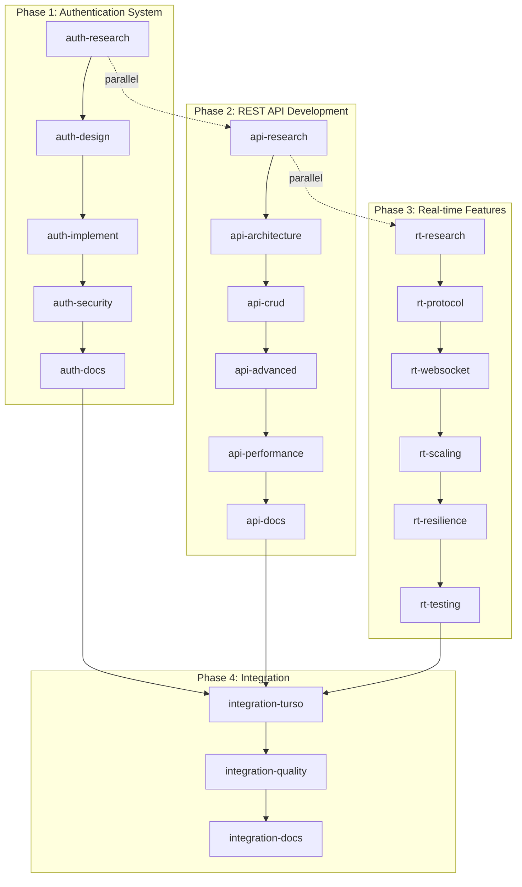

# 🔗 PRP Examples - Dependency Graph & Execution Flow

## 📊 Visual Dependency Map



## 🚀 Parallel Execution Strategy

### Wave 1: Research (Parallel)
```
┌─────────────────┐  ┌─────────────────┐  ┌─────────────────┐
│ auth-research   │  │ api-research    │  │ rt-research     │
│ Agent: research │  │ Agent: research │  │ Agent: research │
│ Time: 2h        │  │ Time: 2h        │  │ Time: 2h        │
└─────────────────┘  └─────────────────┘  └─────────────────┘
        │                    │                    │
        └────────────────────┴────────────────────┘
                             │
                    Total Time: 2h (parallel)
```

### Wave 2: Design & Architecture (Parallel)
```
┌─────────────────┐  ┌─────────────────┐  ┌─────────────────┐
│ auth-design     │  │ api-architecture│  │ rt-protocol     │
│ Agent: architect│  │ Agent: sys-arch │  │ Agent: analyst  │
│ Time: 1.5h      │  │ Time: 2h        │  │ Time: 1.5h      │
└─────────────────┘  └─────────────────┘  └─────────────────┘
        │                    │                    │
        └────────────────────┴────────────────────┘
                             │
                    Total Time: 2h (parallel)
```

### Wave 3: Implementation (Parallel)
```
┌─────────────────┐  ┌─────────────────┐  ┌─────────────────┐
│ auth-implement  │  │ api-crud        │  │ rt-websocket    │
│ Agent: coder    │  │ Agent: backend  │  │ Agent: coder    │
│ Time: 3h        │  │ Time: 3h        │  │ Time: 3h        │
└─────────────────┘  └─────────────────┘  └─────────────────┘
```

## 📋 Detailed Task Dependencies

### Authentication System Dependencies
```yaml
auth-research:
  depends_on: []
  unlocks: [auth-design]
  resources: 
    - Web search access
    - Security documentation
    - OWASP guidelines

auth-design:
  depends_on: [auth-research]
  unlocks: [auth-implement]
  resources:
    - Research findings
    - PRP templates
    - SPARC methodology

auth-implement:
  depends_on: [auth-design]
  unlocks: [auth-security]
  resources:
    - Design specifications
    - Code templates
    - Testing frameworks

auth-security:
  depends_on: [auth-implement]
  unlocks: [auth-docs, integration-turso]
  resources:
    - Implementation code
    - Security tools
    - Vulnerability scanners

auth-docs:
  depends_on: [auth-security]
  unlocks: [integration-turso]
  resources:
    - Validated code
    - Security reports
    - Documentation templates
```

### REST API Development Dependencies
```yaml
api-research:
  depends_on: []
  unlocks: [api-architecture]
  resources:
    - API standards docs
    - OpenAPI specs
    - Industry best practices

api-architecture:
  depends_on: [api-research]
  unlocks: [api-crud]
  resources:
    - Research insights
    - Architecture patterns
    - Scalability guidelines

api-crud:
  depends_on: [api-architecture]
  unlocks: [api-advanced]
  resources:
    - Architecture diagrams
    - Database schemas
    - Validation rules

api-advanced:
  depends_on: [api-crud]
  unlocks: [api-performance]
  resources:
    - CRUD implementation
    - Caching strategies
    - Rate limiting patterns

api-performance:
  depends_on: [api-advanced]
  unlocks: [api-docs]
  resources:
    - Complete API code
    - Benchmarking tools
    - Optimization guides

api-docs:
  depends_on: [api-performance]
  unlocks: [integration-turso]
  resources:
    - Optimized code
    - Performance metrics
    - OpenAPI tools
```

### Real-time Features Dependencies
```yaml
rt-research:
  depends_on: []
  unlocks: [rt-protocol]
  resources:
    - WebSocket docs
    - SSE specifications
    - Protocol comparisons

rt-protocol:
  depends_on: [rt-research]
  unlocks: [rt-websocket]
  resources:
    - Research data
    - Decision matrices
    - Use case scenarios

rt-websocket:
  depends_on: [rt-protocol]
  unlocks: [rt-scaling]
  resources:
    - Protocol selection
    - Implementation guides
    - Client/server templates

rt-scaling:
  depends_on: [rt-websocket]
  unlocks: [rt-resilience]
  resources:
    - WebSocket implementation
    - Redis/RabbitMQ docs
    - Load balancing patterns

rt-resilience:
  depends_on: [rt-scaling]
  unlocks: [rt-testing]
  resources:
    - Scaling architecture
    - Error handling patterns
    - Reconnection strategies

rt-testing:
  depends_on: [rt-resilience]
  unlocks: [integration-turso]
  resources:
    - Complete implementation
    - Test frameworks
    - Load testing tools
```

## 🔄 Resource Conflicts & Resolution

### Potential Conflicts
1. **Researcher Agent Overload**
   - Conflict: 3 research tasks in parallel
   - Resolution: Use 3 researcher instances or stagger by 30min

2. **Coder Agent Bottleneck**
   - Conflict: Multiple implementation tasks
   - Resolution: Assign specialized coders (backend-dev, frontend-dev)

3. **Documentation Overlap**
   - Conflict: Multiple docs tasks completing simultaneously
   - Resolution: Coordinate through memory system

### Resource Allocation Matrix
```
Time Slot   | Researcher | Architect | Coder    | Tester | Reviewer
---------------------------------------------------------------
0-2h        | All 3      | -         | -        | -      | -
2-4h        | -          | Auth+API  | -        | -      | -
4-7h        | -          | RT        | All 3    | -      | -
7-9h        | -          | -         | Advanced | Auth   | -
9-11h       | -          | -         | Perf     | API+RT | -
11-12h      | -          | -         | -        | -      | Quality
12-13h      | -          | -         | -        | -      | Final
```

## 🎯 Critical Path Analysis

### Primary Critical Path
```
auth-research (2h) → auth-design (1.5h) → auth-implement (3h) → 
auth-security (2h) → integration-turso (1h) → integration-quality (2h)

Total: 11.5 hours
```

### Secondary Critical Paths
- API Path: 13.5 hours
- RT Path: 12.5 hours

### Float Analysis
Tasks with float (can be delayed):
- `auth-docs`: 2h float
- `api-docs`: 1h float  
- `integration-docs`: 3h float

## 📊 Gantt Chart Representation

```
Task                  |0h  2h  4h  6h  8h  10h 12h 14h 16h 18h
-----------------------------------------------------------------
auth-research         |████
auth-design           |    ███
auth-implement        |       ██████
auth-security         |              ████
auth-docs             |                  ████
api-research          |████
api-architecture      |    ████
api-crud              |        ██████
api-advanced          |               ██████
api-performance       |                      ████
api-docs              |                          ███
rt-research           |████
rt-protocol           |    ███
rt-websocket          |       ██████
rt-scaling            |              ████
rt-resilience         |                  ████
rt-testing            |                      ████
integration-turso     |                          ██
integration-quality   |                            ████
integration-docs      |                                ███
```

## 🚀 Optimization Opportunities

1. **Super-Parallel Execution**
   - Deploy 18 specialized agents simultaneously
   - Theoretical minimum time: 4 hours

2. **Pipeline Processing**
   - Start implementation while design continues
   - Overlap documentation with testing

3. **Continuous Integration**
   - Save to Turso after each phase
   - Incremental quality checks

4. **Resource Pooling**
   - Share research findings via memory
   - Reuse code templates across examples

---

*This dependency graph enables optimal parallel execution while maintaining quality and coherence across all PRP examples.*