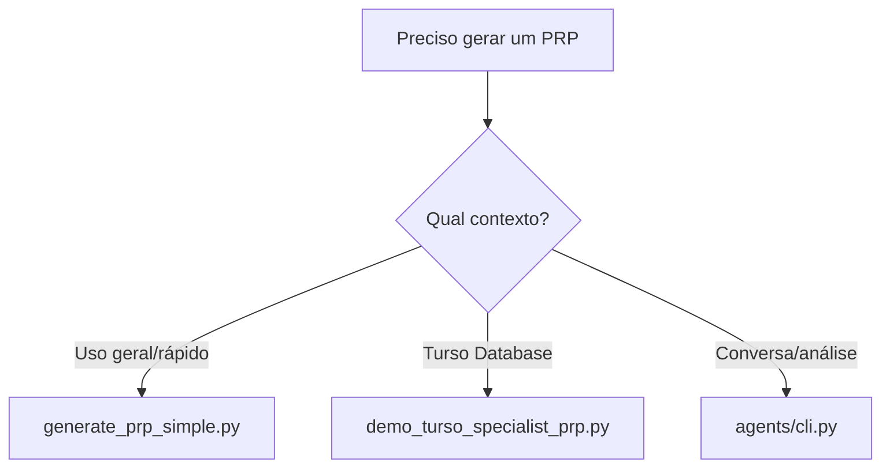

# 🎯 Guia Simplificado: Como Gerar PRPs

## ✅ 3 Formas Essenciais de Gerar PRPs

### 1. **Para Uso Geral** ⭐ RECOMENDADO
```bash
cd prp-agent
python generate_prp_simple.py
```
**Quando usar:** Geração rápida sem complexidade
**Vantagens:** Simples, direto, sem dependências

### 2. **Para Turso Database** 
```bash
cd prp-agent
python demo_turso_specialist_prp.py
```
**Quando usar:** Operações específicas com Turso
**Vantagens:** Expertise em Turso & MCP

### 3. **Via Agente Conversacional**
```bash
cd agents
python cli.py
```
**Quando usar:** Interface interativa natural
**Vantagens:** Análise LLM inteligente

## 🚀 Qual Usar?



## 📝 Exemplo Rápido

### Opção 1: Gerador Simples (Mais Usado)
```bash
cd prp-agent
python generate_prp_simple.py

# Responda as perguntas:
# > Nome do PRP: sistema-auth
# > Descrição: Sistema de autenticação JWT
# > Objetivo: Implementar login seguro
```

### Opção 2: Para Turso
```bash
cd prp-agent
python demo_turso_specialist_prp.py

# Siga o assistente especializado
```

### Opção 3: Conversacional
```bash
cd agents
python cli.py

# Digite: "Crie um PRP para sistema de pagamentos"
```

## ✨ Dica Final

Para 90% dos casos, use `generate_prp_simple.py` - é a forma mais rápida e eficiente!

---
*Guia simplificado - 3 formas essenciais de gerar PRPs*