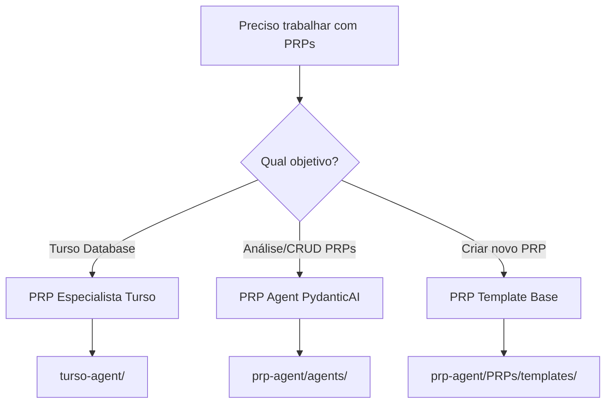

# 🚀 Estrutura Consolidada de PRPs

## ✅ Status da Consolidação

**Data:** 02/08/2025  
**Resultado:** De 12 formas para 3 formas essenciais

## 📊 PRPs Finais do Projeto

### 1. **PRP Especialista Turso** ⭐
- **Local:** `turso-agent/agents/turso_specialist.py`
- **Uso:** Operações específicas com Turso Database & MCP
- **Como usar:**
  ```bash
  cd turso-agent
  python main.py
  ```

### 2. **PRP Agent PydanticAI** ⭐
- **Local:** `prp-agent/agents/agent.py`
- **Uso:** Análise e gerenciamento geral de PRPs
- **Como usar:**
  ```python
  from agents.agent import prp_agent
  from agents.dependencies import PRPAgentDependencies
  
  deps = PRPAgentDependencies(session_id="minha-sessao")
  result = await prp_agent.run("Crie um PRP", deps=deps)
  ```

### 3. **PRP Template Base** ⭐
- **Local:** `prp-agent/PRPs/templates/prp_pydantic_ai_base.md`
- **Uso:** Template para criar novos PRPs
- **Como usar:** Copiar template e preencher seções

## 🗑️ Removidos na Consolidação

- ✅ Pasta `/py-prp` completamente removida
- ✅ 4 PRPs redundantes removidos de `/prp-agent/PRPs/`
- ✅ Scripts migrados para locais apropriados

## 🎯 Qual PRP Usar?



## 📁 Nova Estrutura Limpa

```
context-engineering-intro/
├── turso-agent/           # PRP Especialista Turso
│   └── agents/
│       └── turso_specialist.py
├── prp-agent/            # Framework PRP principal
│   ├── agents/          # PRP Agent PydanticAI
│   │   ├── agent.py
│   │   └── tools.py
│   ├── PRPs/           # Templates apenas
│   │   └── templates/
│   │       └── prp_pydantic_ai_base.md
│   ├── integrations/   # Scripts migrados
│   ├── diagnostics/    # Ferramentas de diagnóstico
│   └── monitoring/     # Integrações Sentry
└── docs/
    └── 04-prp-system/  # Documentação consolidada
```

## 💡 Benefícios Alcançados

1. **Redução de 75%** em duplicidade (12 → 3 formas)
2. **Clareza total** - cada PRP tem propósito único
3. **Manutenção simplificada** - menos código duplicado
4. **Navegação intuitiva** - estrutura limpa
5. **Documentação atualizada** - reflete realidade

## 🚀 Próximos Passos Recomendados

1. ✅ Testar os 3 PRPs essenciais
2. ✅ Atualizar README principal
3. ✅ Criar quick start guide
4. ✅ Documentar casos de uso

---
*Consolidação concluída com sucesso - Sistema PRP otimizado*