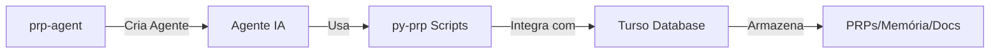

# 🔍 Comparação dos Projetos PRP: py-prp vs prp-agent

## 📊 Visão Geral

Você tem dois projetos relacionados a PRP (Product Requirement Prompts) com propósitos diferentes:

### 📁 `/py-prp` - Scripts Python de Integração
**Propósito:** Scripts utilitários para integração com bancos de dados e serviços
**Foco:** Ferramentas de suporte, migração e sincronização

### 🤖 `/prp-agent` - Framework de Agentes IA
**Propósito:** Template completo para criar agentes de IA usando PydanticAI
**Foco:** Desenvolvimento de agentes inteligentes com metodologia PRP

## 🎯 Diferenças Principais

### 1. **Objetivo**

**py-prp:**
- Scripts independentes para tarefas específicas
- Integração com Turso Database
- Sincronização de documentos
- Ferramentas de migração e diagnóstico

**prp-agent:**
- Framework completo para criar agentes de IA
- Metodologia estruturada de desenvolvimento
- Templates e exemplos prontos
- Fluxo de trabalho PRP completo

### 2. **Conteúdo**

**py-prp (25 arquivos Python):**
```
📂 py-prp/
├── 🔧 Integração com Turso
│   ├── prp_mcp_integration.py      # Integração PRP + MCP Turso
│   ├── real_mcp_integration.py     # Integração real MCP
│   ├── setup_prp_database.py       # Setup do banco PRP
│   └── migrate_to_turso.py         # Migração para Turso
│
├── 🧪 Scripts de Teste
│   ├── test_turso_token.py         # Teste de tokens
│   ├── test_memory_system.py       # Teste do sistema de memória
│   └── diagnose_turso_mcp.py       # Diagnóstico MCP
│
├── 📊 Sincronização de Docs
│   ├── sync_docs_automatico.py     # Sync automático
│   ├── mcp_smart_sync.py           # Sync inteligente
│   └── reorganizar_clusters_final.py # Organização de clusters
│
└── 🛠️ Utilitários
    ├── memory_demo.py              # Demo de memória
    ├── docs_search_demo.py         # Demo de busca
    └── sistema_completo_final.py   # Sistema completo
```

**prp-agent (Framework Completo):**
```
📂 prp-agent/
├── 📚 Documentação
│   ├── README_TEMPLATE.md          # Guia completo do template
│   └── CLAUDE.md                   # Regras para desenvolvimento
│
├── 🎯 Metodologia PRP
│   ├── PRPs/
│   │   ├── INITIAL.md             # Template inicial
│   │   └── templates/             # Templates PRP
│   │
│   └── .claude/commands/
│       ├── generate-pydantic-ai-prp.md
│       └── execute-pydantic-ai-prp.md
│
├── 🤖 Exemplos de Agentes
│   ├── basic_chat_agent/          # Chat simples
│   ├── tool_enabled_agent/        # Com ferramentas
│   ├── structured_output_agent/   # Saída estruturada
│   ├── testing_examples/          # Testes
│   └── main_agent_reference/      # Referência completa
│
└── 🔧 Ambiente Virtual
    └── venv/                      # Python 3.13 configurado
```

### 3. **Casos de Uso**

**py-prp é usado para:**
- ✅ Configurar bancos de dados PRP
- ✅ Sincronizar documentação com Turso
- ✅ Testar integrações MCP
- ✅ Migrar dados entre sistemas
- ✅ Demonstrar funcionalidades

**prp-agent é usado para:**
- ✅ Criar novos agentes de IA do zero
- ✅ Seguir metodologia PRP estruturada
- ✅ Implementar agentes com ferramentas
- ✅ Testar agentes com TestModel
- ✅ Produzir agentes prontos para produção

## 🔄 Como Eles Se Relacionam

### Fluxo de Trabalho Integrado:



1. **prp-agent** cria agentes inteligentes usando a metodologia PRP
2. Esses agentes podem usar os **scripts py-prp** para:
   - Armazenar PRPs no banco de dados
   - Manter memória persistente
   - Sincronizar documentação
   - Integrar com MCP Turso

## 💡 Exemplo Prático

### Criando um Agente com Memória Persistente:

**1. Use prp-agent para criar o agente:**
```bash
cd prp-agent
# Definir requisitos em PRPs/INITIAL.md
/generate-pydantic-ai-prp PRPs/INITIAL.md
/execute-pydantic-ai-prp PRPs/generated_prp.md
```

**2. Integre com py-prp para persistência:**
```python
# No agente criado, use scripts do py-prp
from py_prp.prp_mcp_integration import MCPTursoClient

# Agente pode agora:
- Salvar conversas no Turso
- Manter memória entre sessões
- Armazenar PRPs gerados
```

## 🚀 Recomendações de Uso

### Para Desenvolvimento de Agentes:
1. **Comece com prp-agent** - Use o template completo
2. **Siga o fluxo PRP** - INITIAL → Generate → Execute
3. **Use os exemplos** - Estude os 5 exemplos incluídos
4. **Teste com TestModel** - Valide sem custos de API

### Para Integração e Persistência:
1. **Use scripts py-prp** - Para todas as integrações
2. **Configure Turso** - Para memória persistente
3. **Sincronize docs** - Mantenha documentação atualizada
4. **Monitore com MCP** - Use as ferramentas de diagnóstico

## 📋 Resumo

- **py-prp**: Caixa de ferramentas com scripts Python para integração
- **prp-agent**: Framework completo para criar agentes de IA
- **Juntos**: Sistema completo para agentes inteligentes com memória persistente

Ambos os projetos se complementam: prp-agent fornece a estrutura para criar agentes, enquanto py-prp fornece as ferramentas para integrá-los com bancos de dados e manter persistência.

---
*Documento criado para esclarecer as diferenças e relações entre os projetos PRP*